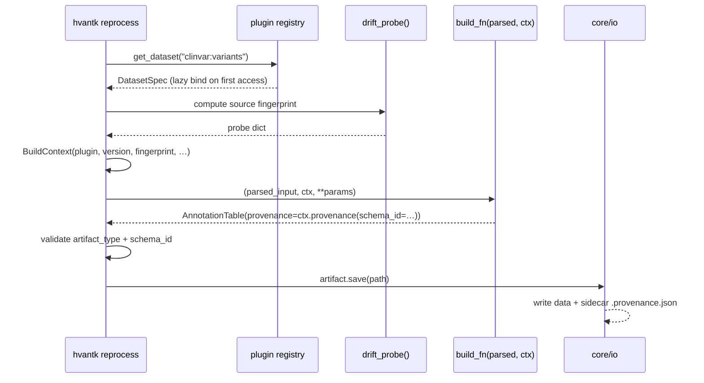

[](https://github.com/bigbio/hvantk/actions/workflows/python-package-conda.yml)
[](https://github.com/bigbio/hvantk/actions/workflows/python-app.yml)
[](https://www.python.org)
[](LICENSE)
[](https://bigbio.github.io/hvantk)

# hvantk

**Hail-based toolkit for multiomics variant annotation and analysis.**

`hvantk` is a modular toolkit that uses [Hail](https://hail.is/) to annotate and analyze variants, genes, proteins, and expression data from heterogeneous omics sources. The library enables multiomics integration to improve the interpretation of genetic variants.

## Installation

```bash
git clone https://github.com/bigbio/hvantk
cd hvantk
poetry install
eval "$(poetry env activate)"
```

**Prerequisites**: Python >=3.10, Hail

### Optional extras

The base install is intentionally lean — heavy plotting and ML dependencies are
opt-in via Poetry extras. Install only what a given workflow needs:

| Extra | Enables | Pulls in |
| --- | --- | --- |
| `viz` | Static and interactive plotting | matplotlib, seaborn, plotly |
| `interactive` | Interactive plots / dashboards | plotly |
| `duckdb` | DuckDB-backed queries | duckdb |
| `hgc` | Joint genotyping (incl. genotype adjustment + plots) | gnomad, matplotlib, seaborn, plotly |
| `psroc` | Pathogenicity Score ROC analysis | matplotlib, plotly, scikit-learn |
| `ptm` | CPTAC proteomics builders | cptac |
| `constraint` | Tissue-specificity / constraint metrics | tspex, matplotlib, seaborn |
| `ancestry` | Ancestry inference (PCA + Random Forest + plots) | scikit-learn, matplotlib, seaborn |
| `ml` | scikit-learn-backed features only | scikit-learn |
| `expression` | `hvantk expression summarize` and `markers` (scanpy aggregation / marker detection) | scanpy |

```bash
# One or more extras at once
poetry install --extras "ancestry psroc"

# Or a single extra
poetry install --extras ml
```

Verify it works:

```bash
hvantk utils check-install
hvantk --help
```

## Toolkit

| Tool | Description | Command | Docs |
|------|-------------|---------|------|
| **Downloads** | Acquire external datasets (ClinVar, ClinGen, HGNC, etc.) | `hvantk download <source>` | [Data Sources](docs_site/guide/data-sources.md) |
| **Dataset builds** | Build any plugin dataset (download → parse → build → drift check) | `hvantk reprocess <plugin>:<dataset>` | [Usage Guide](docs_site/guide/usage.md) |
| **HGC** | Joint genotyping pipeline (GVCF combining, QC, format conversion) | `hvantk hgc` | [HGC](docs_site/tools/hgc.md) |
| **Ancestry** | Ancestry inference (PCA + Random Forest classification) | `hvantk ancestry-inference` | [Ancestry](docs_site/tools/ancestry.md) |
| **QTL Cascade** | Molecular QTL integration (eQTL + pQTL cascade, colocalization ABF) | `hvantk qtlcascade` | [QTL Cascade](docs_site/tools/qtlcascade.md) |
| **EnrichEx** | Gene set enrichment (overlap testing + rare variant burden) | `hvantk enrichex` | [EnrichEx](docs_site/tools/enrichex.md) |
| **PS-ROC** | Pathogenicity score ROC evaluation against ClinVar labels | `hvantk psroc` | [PS-ROC](docs_site/tools/psroc.md) |
| **PTM** | Post-translational modification variant classification | `hvantk ptm` | [PTM](docs_site/tools/ptm.md) |
| **Expression** | Expression analysis (summarize, marker extraction) | `hvantk expression` | [Usage Guide](docs_site/guide/usage.md) |

## Architecture

`hvantk` is organized in four code layers (`core/`, `algorithms/`,
`skills/`, `tools/`) plus a substrate-level data registry (`resources/`).
A strict one-way dependency rule is enforced by tests in
[`hvantk/tests/test_dependency_directions.py`](hvantk/tests/test_dependency_directions.py):

<p align="center">
  
</p>

**Why the directions matter:** `skills/` adapters can rot when upstream APIs
change without algorithms breaking; `algorithms/` evolve without churning
the source-adapter layer. `core/` and `resources/` are the stable substrate
everyone depends on — neither imports upward.

### Data model

Four semantic artifact types live in [`hvantk/core/models/`](hvantk/core/models/),
each backed by one of several native engines:

| Artifact | Backends | On-disk format | Used for |
|---|---|---|---|
| [`AnnotationTable`](hvantk/core/models/annotation_table.py) | `hail` / `pandas` | `.ht/` or `.parquet` | variants, gene-disease pairs, eQTLs, PTM sites |
| [`ExpressionMatrix`](hvantk/core/models/expression_matrix.py) | `anndata` | `.h5ad` | bulk + single-cell expression, proteomics matrices |
| [`VariantMatrix`](hvantk/core/models/variant_matrix.py) | `hail-mt` | `.mt/` | multi-sample variant cohorts (genotypes × samples × multi-field entries) |
| [`GeneSet`](hvantk/core/models/gene_set.py) | (in-memory `frozenset`) | `.geneset.json` | curated gene collections (CHD, MSigDB, …) |

Every artifact carries a [`Provenance`](hvantk/core/models/provenance.py)
record — plugin name, version, source fingerprint, schema id, build
timestamp, and a `parents: tuple[Provenance, ...]` chain for algorithm
derivations. The `@algorithm` decorator stamps input provenances onto
output artifacts automatically, so the build graph is preserved end-to-end.

Artifacts expose a **portable query API** (`filter`, `select`, `join`,
`with_columns`, `group_by().agg()`) via the [`col(...)`](hvantk/core/models/_expr.py)
expression DSL, compiled to either Hail or pandas at execution time —
algorithms can be written backend-agnostically. When the algorithm legitimately
needs the raw native object, [`core_io.load_native(path)`](hvantk/core/io/__init__.py)
returns `(native_obj, Provenance)` zero-cost.

### Plugin contract — adding a new data source

Each plugin under `hvantk/skills/<plugin>/` declares itself via
[`plugin.yaml`](hvantk/skills/clinvar/plugin.yaml) and provides a builder
that returns a typed artifact:

```python
# hvantk/skills/clinvar/builder.py
def build_clinvar(parsed_input, ctx: BuildContext, **params) -> AnnotationTable:
    ht = hl.import_vcf(str(parsed_input), force=True, ...).rows().key_by("locus", "alleles")
    return AnnotationTable.from_hail(
        ht, provenance=ctx.provenance(schema_id="clinvar-variants-v1")
    )
```

The platform orchestrator [`run_builder_for_spec`](hvantk/core/plugin/run_builder.py)
ties it all together at build time:



Twenty-one plugins ship today: `clinvar`, `clingen`, `gencc`, `gwas-catalog`,
`hgnc`, `gtex-eqtl`, `insider`, `msigdb`, `uniprot-ptm`, `peptideatlas`,
`expression-atlas`, `cptac`, `ucsc-cellbrowser`, `gevir`, `gnomad-metrics`,
`ensembl-gene`, `dbnsfp`, `cosmic-cgc`, `pqtl`, `alphagenome`, `onek-genomes`.

### Project structure

```
hvantk/
├── core/                       # platform substrate — stable contracts
│   ├── models/                 # AnnotationTable, ExpressionMatrix, VariantMatrix, GeneSet,
│   │                           #   Provenance, BuildContext, Expr DSL,
│   │                           #   AlgorithmMeta (@algorithm decorator)
│   ├── io/                     # save / load / save_native / load_native,
│   │                           #   sidecar provenance manifests, legacy shim
│   ├── plugin/                 # plugin registry, run_builder_for_spec,
│   │                           #   two-pass discovery (DatasetManifest → DatasetSpec)
│   ├── tool/                   # tool manifest discovery (descriptive)
│   ├── builders/               # shared builder helpers (create_table_base, …)
│   ├── streamers/              # low-level chunked-IO for raw upstream downloads
│   └── utils/                  # generic helpers (hail context, file utils)
│
├── algorithms/                 # analytics — consume artifacts, return artifacts
│   ├── ancestry/               # PCA + Random Forest ancestry inference
│   ├── enrichex/               # gene set enrichment + burden testing
│   ├── expression/             # tissue specificity (tau, gini, etc.)
│   ├── hgc/                    # joint genotyping (gvcf combine, VDS, QC)
│   ├── ptm/                    # PTM coordinate mapping + atlas
│   ├── psroc/                  # pathogenicity score ROC analysis
│   ├── qtlcascade/             # eQTL → pQTL cascade + colocalization
│   └── annotation/             # multi-source annotation pipelines
│
├── skills/                     # data-source plugins (21 total)
│   ├── <plugin>/
│   │   ├── plugin.yaml         # declarative manifest (drives discovery + CLI)
│   │   ├── builder.py          # Phase B: (parsed, ctx) → Artifact
│   │   ├── drift_probe.py      # upstream fingerprint
│   │   ├── cli.py              # downloader (auto-wired via manifest cli: block)
│   │   └── tests/              # per-plugin conformance tests + fixtures
│   └── _conventions/SKILL.md   # contract documentation
│
├── tools/                      # CLI wiring + workflow orchestration
│   ├── plugins/                # download, drift, reprocess, plugins list
│   ├── hgc/                    # joint-genotyping CLI (lazy-loaded)
│   ├── ancestry/, enrichex/, expression/, ptm/, qtl/, infra/, genesets/
│   └── tools_cli.py            # tool registry inspection
│
├── resources/                  # platform metadata (unified catalog registry)
└── tests/                      # cross-cutting tests (dependency directions,
                                #   plugin conformance, io round-trips,
                                #   Expr algebra parity, etc.)
```

### How to extend

| Add | Where | Pattern |
|---|---|---|
| A new data source | `hvantk/skills/<plugin>/` | Write `plugin.yaml` + `builder.py` (returns `Artifact`) + `drift_probe.py`. Loader auto-discovers. |
| A new algorithm | `hvantk/algorithms/<domain>/` | Decorate with `@algorithm(name=…, backends=[…], inputs={…}, outputs={…})`. Operate on Artifact inputs (or use `load_native` for Hail-heavy work). |
| A new CLI command | `hvantk/tools/<domain>/` | Add the click command + a `.tool.yaml` manifest. Wire in `hvantk/hvantk.py`. |
| A new artifact format | `hvantk/core/io/_formats.py` + dispatch in `__init__.py` | Add `save_<artifact>_<ext>` / `load_<artifact>_<ext>`. |

## Documentation

**Full docs site:** [https://bigbio.github.io/hvantk](https://bigbio.github.io/hvantk)

- [Data Sources](docs_site/guide/data-sources.md) -- Available annotations and how to acquire them
- [Examples](docs_site/examples/index.md) -- Tutorials and walkthroughs for each tool
- [Architecture](docs_site/architecture.md) -- Design patterns and extension points

## Citation

If you use hvantk in your research, please cite:

```bibtex
@software{hvantk2024,
  title = {hvantk: Hail-based toolkit for multi-omics variant annotation and analysis},
  author = {Perez-Riverol, Yasset and Audain, Enrique},
  year = {2024},
  url = {https://github.com/bigbio/hvantk}
}
```

## Contributing

See [CONTRIBUTING.md](CONTRIBUTING.md) for development workflow, code style, and testing requirements.

```bash
poetry install
pytest -q
hvantk --help
```

## License

MIT License - see [LICENSE](LICENSE).

## Support

- [GitHub Issues](https://github.com/bigbio/hvantk/issues)
- [Documentation](https://bigbio.github.io/hvantk)
