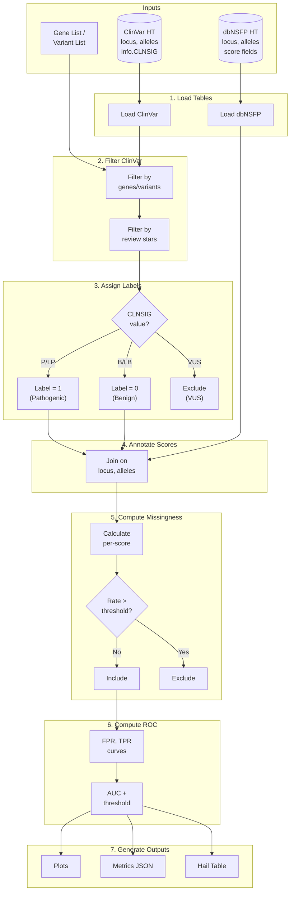

# PSROC: Prediction Score ROC Analysis

PSROC is a module within hvantk that evaluates variant pathogenicity prediction scores using ROC (Receiver Operating Characteristic) curve analysis. It compares prediction scores from databases like dbNSFP against ClinVar truth labels to assess their discriminative power.

## Overview

The PSROC module provides an end-to-end pipeline for benchmarking variant pathogenicity prediction scores:

### Primary Functionality

- **ROC Analysis** - Compute AUC, optimal thresholds, and sensitivity/specificity for each score
- **Missingness Handling** - Track and filter scores based on missing value rates
- **Visualization** - Generate publication-quality ROC curves and comparison plots
- **Pipeline Orchestration** - Single command runs the complete analysis workflow

### Key Features

- **Multi-Score Comparison** - Evaluate multiple prediction scores simultaneously
- **Configurable Thresholds** - Youden's J, closest-to-corner, and F1 optimization methods
- **Automatic Filtering** - Exclude scores with excessive missing values
- **Flexible Input** - Filter by genes, gene lists, or specific variants
- **Comprehensive Outputs** - JSON metrics, TSV exports, and visualization plots

## Installation

PSROC is part of the hvantk package. Install using Poetry:

```bash
git clone https://github.com/bigbio/hvantk
cd hvantk
poetry install
poetry shell
```

## Quick Start

### Command-Line Interface

```bash
# Basic usage with specific genes
hvantk psroc \
  --genes BRCA1,BRCA2 \
  --clinvar-ht /data/clinvar_grch38.ht \
  --dbnsfp-ht /data/dbnsfp_grch38.ht \
  --scores "CADD_phred,REVEL_score,MetaLR_score" \
  --output-dir /results/brca_psroc

# View execution plan without running
hvantk psroc \
  --genes BRCA1 \
  --clinvar-ht /data/clinvar.ht \
  --dbnsfp-ht /data/dbnsfp.ht \
  --scores "CADD_phred" \
  --output-dir /results \
  --dry-run
```

### Python API

```python
from hvantk.psroc import PSROCConfig, PSROCPipeline

# Configure analysis
config = PSROCConfig(
    genes=["BRCA1", "BRCA2"],
    clinvar_ht="/data/clinvar_grch38.ht",
    dbnsfp_ht="/data/dbnsfp_grch38.ht",
    scores=["CADD_phred", "REVEL_score", "MetaLR_score"],
    output_dir="/results/brca_psroc",
    max_missingness=0.3,
)

# Run pipeline
pipeline = PSROCPipeline(config)
result = pipeline.run()

# View results
print(result.summary())
for score_name, roc in result.metrics.items():
    print(f"{score_name}: AUC={roc.auc:.3f}")
```

## Example with Synthetic Data

The PSROC module includes synthetic test data for learning and testing. This data
allows you to run the complete pipeline without needing real ClinVar or dbNSFP tables.

### Running the Example

```bash
# Run the example script (builds Hail Tables from synthetic TSVs and runs full pipeline)
python examples/psroc/run_psroc_example.py --output-dir /tmp/psroc_example
```

### Synthetic Dataset Characteristics

The synthetic dataset contains:

| Component | Description |
|-----------|-------------|
| **Variants** | 100 variants across BRCA1, BRCA2, and TP53 |
| **Labels** | 50 pathogenic, 40 benign, 10 VUS (excluded) |
| **Scores** | 4 prediction scores with varying performance |

### Expected Results

The synthetic scores are designed to demonstrate different discriminative capabilities:

| Score | Expected AUC | Missingness | Status |
|-------|-------------|-------------|--------|
| REVEL_score | ~0.95 | ~2% | Included |
| CADD_phred | ~0.90 | ~5% | Included |
| MetaLR_score | ~0.75 | ~10% | Included |
| VEST4_score | N/A | ~40% | Excluded |

The VEST4_score is intentionally designed with high missingness to demonstrate
the automatic score exclusion feature when missingness exceeds the threshold.

### Test Data Files

Located in `hvantk/tests/testdata/psroc/`:

- `synthetic_clinvar.tsv` - ClinVar-like variant annotations
- `synthetic_dbnsfp.tsv` - dbNSFP-like prediction scores
- `test_genes.txt` - Gene list for `--genes-file` testing
- `test_variants.txt` - Variant list for `--variants` testing

## Detailed Usage

### Input Sources

PSROC requires exactly one input source to select variants for analysis:

#### Option 1: Gene Symbols

```bash
# Comma-separated gene symbols
hvantk psroc --genes BRCA1,BRCA2,TP53 ...

# From a file (one gene per line)
hvantk psroc --genes-file /data/cardiac_genes.txt ...
```

#### Option 2: Variant List

```bash
# Variant file format: chr:pos:ref:alt (one per line)
hvantk psroc --variants /data/my_variants.txt ...
```

Example variant file:
```
chr1:12345:A:T
chr2:67890:G:C
chr17:41245466:G:A
```

#### Option 3: Named Gene Set Collection (Multi-Group Analysis)

Run PSROC independently for each named gene set in a collection. Each group
gets its own output subdirectory with per-group metrics and plots.

```bash
# From a JSON gene set collection
hvantk psroc --gene-sets /data/disease_gene_sets.json ...

# From a GMT file (e.g., MSigDB pathways)
hvantk psroc --gene-sets /data/pathways.gmt ...
```

Gene set collections can be prepared from various sources using hvantk's
streamer layer. See [Preparing Gene Set Collections](#preparing-gene-set-collections)
and the example script `examples/psroc/prepare_gene_sets.py`.

### Required Tables

PSROC requires pre-built Hail Tables for ClinVar and dbNSFP:

```bash
# Build ClinVar table
hvantk mktable clinvar \
  --raw-input /data/clinvar.vcf.bgz \
  --output-ht /data/clinvar_grch38.ht

# Build dbNSFP table (from concatenated BGZF — see Deployment Guide)
hvantk mktable dbnsfp \
  --raw-input /data/dbNSFP4.9a_variant.bgz \
  --output-ht /data/dbnsfp_grch38.ht
```

### Score Selection

Specify dbNSFP score fields to evaluate:

```bash
--scores "CADD_phred,REVEL_score,MetaLR_score,VEST4_score,ClinPred_score"
```

Common prediction scores available in dbNSFP:
- `CADD_phred` - Combined Annotation Dependent Depletion
- `REVEL_score` - Rare Exome Variant Ensemble Learner
- `MetaLR_score` - Meta-analytic logistic regression
- `VEST4_score` - Variant Effect Scoring Tool v4
- `ClinPred_score` - Clinical Prediction score
- `PrimateAI_score` - Primate AI pathogenicity prediction
- `DANN_score` - Deep Annotation Neural Network

### Missingness Handling

Scores with high rates of missing values can bias ROC analysis. PSROC automatically:

1. Computes missingness statistics for each score
2. Excludes scores exceeding the threshold from ROC analysis
3. Reports all missingness statistics in the output

```bash
# Default: exclude scores with >30% missing values
hvantk psroc ... --max-missingness 0.3

# Stricter threshold for high-quality analysis
hvantk psroc ... --max-missingness 0.1

# Relaxed threshold for exploratory analysis
hvantk psroc ... --max-missingness 0.5
```

### ClinVar Review Status Filtering

Filter variants by ClinVar review status (star rating):

```bash
# Require at least 1 star (default)
hvantk psroc ... --min-stars 1

# Require expert panel review (3+ stars)
hvantk psroc ... --min-stars 3
```

Star ratings:
- 0 stars: No assertion criteria provided
- 1 star: Single submitter with criteria
- 2 stars: Multiple submitters, no conflicts
- 3 stars: Reviewed by expert panel
- 4 stars: Practice guideline

### Threshold Optimization Methods

PSROC supports three methods for finding optimal classification thresholds:

```bash
# Youden's J statistic (default) - maximizes (sensitivity + specificity - 1)
hvantk psroc ... --threshold-method youden

# Closest to corner - minimizes distance to perfect classifier (0,1)
hvantk psroc ... --threshold-method closest_to_corner

# F1 score approximation
hvantk psroc ... --threshold-method f1
```

## Pipeline Stages

The PSROC pipeline executes seven stages:

| Stage | Description |
|-------|-------------|
| 1. Load Tables | Read ClinVar and dbNSFP Hail Tables |
| 2. Filter ClinVar | Filter to target genes or variants |
| 3. Assign Labels | Convert CLNSIG to binary P/B labels |
| 4. Annotate Scores | Join with dbNSFP prediction scores |
| 5. Compute Missingness | Calculate per-score missingness statistics |
| 6. Compute ROC | Compute ROC metrics for qualifying scores |
| 7. Generate Outputs | Create plots, metrics JSON, and reports |

### Pipeline Workflow Diagram



### Label Assignment

ClinVar clinical significance values are mapped to binary labels:

**Pathogenic (label=1):**
- Pathogenic
- Likely_pathogenic
- Pathogenic/Likely_pathogenic

**Benign (label=0):**
- Benign
- Likely_benign
- Benign/Likely_benign

**Excluded:**
- Uncertain_significance
- Conflicting_interpretations_of_pathogenicity
- All other values

## Output Files

PSROC generates the following outputs:

```
output_dir/
├── psroc_metrics.json           # ROC metrics (AUC, thresholds, etc.)
├── psroc_missingness.json       # Per-score missingness statistics
├── psroc_annotated.ht/          # Hail Table with labels and scores
├── psroc_annotated.tsv          # TSV export (if --export-tsv)
├── plots/
│   ├── psroc_roc_curves.png     # Multi-score ROC overlay
│   ├── psroc_auc_comparison.png # AUC bar chart
│   ├── psroc_missingness.png    # Missingness summary
│   └── psroc_dashboard.png      # Summary dashboard
├── logs/
│   └── psroc_*.log              # Execution log
└── .pipeline_state.json         # State for recovery
```

### Metrics JSON Format

```json
{
  "total_variants": 1250,
  "n_pathogenic": 620,
  "n_benign": 580,
  "n_excluded": 50,
  "scores_included": ["CADD_phred", "REVEL_score"],
  "scores_excluded": ["MetaLR_score"],
  "max_missingness_threshold": 0.3,
  "metrics": {
    "CADD_phred": {
      "score_name": "CADD_phred",
      "auc": 0.892,
      "optimal_threshold": 22.5,
      "sensitivity_at_optimal": 0.85,
      "specificity_at_optimal": 0.82,
      "n_variants_used": 1180,
      "missingness": {
        "n_total": 1200,
        "n_present": 1180,
        "n_missing": 20,
        "missingness_rate": 0.017,
        "included_in_analysis": true
      }
    }
  }
}
```

### Missingness Report Format

```json
{
  "total_variants": 1200,
  "max_missingness_threshold": 0.3,
  "scores_included": ["CADD_phred", "REVEL_score"],
  "scores_excluded": ["MetaLR_score"],
  "scores": {
    "CADD_phred": {
      "n_total": 1200,
      "n_present": 1180,
      "n_missing": 20,
      "missingness_rate": 0.017,
      "included_in_analysis": true,
      "exclusion_reason": null
    },
    "MetaLR_score": {
      "n_total": 1200,
      "n_present": 720,
      "n_missing": 480,
      "missingness_rate": 0.4,
      "included_in_analysis": false,
      "exclusion_reason": "missingness_rate (0.40) exceeds max_missingness (0.30)"
    }
  }
}
```

## CLI Reference

### Command Options

```
hvantk psroc [OPTIONS]

Input Sources (exactly one required):
  --genes TEXT              Comma-separated gene symbols
  --genes-file PATH         File with gene symbols (one per line)
  --variants PATH           Variant list (chr:pos:ref:alt format)
  --gene-sets PATH          Gene set collection (JSON/GMT) for multi-group analysis

Required:
  --clinvar-ht PATH         Path to ClinVar Hail Table
  --dbnsfp-ht PATH          Path to dbNSFP Hail Table
  --scores TEXT             Comma-separated score field names
  -o, --output-dir PATH     Output directory

Optional:
  --reference-genome        GRCh37 or GRCh38 [default: GRCh38]
  --min-stars INTEGER       Minimum ClinVar stars [default: 1]
  --max-missingness FLOAT   Max missingness rate [default: 0.3]
  --threshold-method        youden|closest_to_corner|f1 [default: youden]
  --output-prefix TEXT      Output filename prefix [default: psroc]
  --export-tsv              Export annotated variants as TSV
  --no-plots                Skip plot generation
  --overwrite               Overwrite existing files
  --dry-run                 Show plan without running
  --log-level               DEBUG|INFO|WARNING|ERROR [default: INFO]
```

### Examples

```bash
# Evaluate scores for BRCA genes with stricter criteria
hvantk psroc \
  --genes BRCA1,BRCA2 \
  --clinvar-ht /data/clinvar.ht \
  --dbnsfp-ht /data/dbnsfp.ht \
  --scores "CADD_phred,REVEL_score,MetaLR_score" \
  --output-dir /results/brca \
  --min-stars 2 \
  --max-missingness 0.1

# Use genes from file with TSV export
hvantk psroc \
  --genes-file /data/cardiac_genes.txt \
  --clinvar-ht /data/clinvar.ht \
  --dbnsfp-ht /data/dbnsfp.ht \
  --scores "REVEL_score,ClinPred_score" \
  --output-dir /results/cardiac \
  --export-tsv

# Analyze specific variants
hvantk psroc \
  --variants /data/candidate_variants.txt \
  --clinvar-ht /data/clinvar.ht \
  --dbnsfp-ht /data/dbnsfp.ht \
  --scores "CADD_phred,DANN_score,PrimateAI_score" \
  --output-dir /results/candidates

# Exploratory analysis with relaxed missingness
hvantk psroc \
  --genes TP53 \
  --clinvar-ht /data/clinvar.ht \
  --dbnsfp-ht /data/dbnsfp.ht \
  --scores "CADD_phred,REVEL_score,VEST4_score" \
  --output-dir /results/tp53 \
  --max-missingness 0.5 \
  --no-plots
```

## Python API Reference

### Core Classes

#### PSROCConfig

Configuration dataclass for the pipeline:

```python
from hvantk.psroc import PSROCConfig

config = PSROCConfig(
    # Input sources (exactly one required)
    genes=["BRCA1", "BRCA2"],        # Gene symbols
    genes_file=None,                  # Path to gene file
    variants_path=None,               # Path to variant file
    gene_set_collection=None,         # Dict[str, Set[str]] for multi-group

    # Required paths
    clinvar_ht="/data/clinvar.ht",
    dbnsfp_ht="/data/dbnsfp.ht",

    # Score configuration
    scores=["CADD_phred", "REVEL_score"],

    # Output
    output_dir="/results/psroc",
    output_prefix="psroc",

    # Processing options
    reference_genome="GRCh38",
    min_stars=1,
    max_missingness=0.3,
    threshold_method="youden",

    # Output options
    export_tsv=False,
    overwrite=False,
    generate_plots=True,
)

# Validate configuration
errors = config.validate()
if errors:
    for e in errors:
        print(f"Error: {e}")
```

#### PSROCPipeline

Main pipeline orchestrator:

```python
from hvantk.psroc import PSROCPipeline

pipeline = PSROCPipeline(config)

# Preview execution plan
pipeline.show_plan()

# Run single gene set pipeline
result = pipeline.run()

# --- Multi-group analysis ---
from hvantk.psroc import PSROCConfig, PSROCPipeline

collection_config = PSROCConfig(
    gene_set_collection={
        "cardiac": {"MYH7", "TNNT2", "LMNA"},
        "neuro": {"SCN1A", "SCN2A", "KCNQ2"},
    },
    clinvar_ht="/data/clinvar.ht",
    dbnsfp_ht="/data/dbnsfp.ht",
    scores=["CADD_phred", "REVEL_score"],
    output_dir="/results/multi_group",
)

pipeline = PSROCPipeline(collection_config)
results = pipeline.run_collection()  # Dict[str, PSROCResult]

for group_name, result in results.items():
    print(f"{group_name}: {result.n_total} variants")
    for name, roc in result.metrics.items():
        print(f"  {name}: AUC={roc.auc:.3f}")
```

#### PSROCResult

Results from pipeline execution:

```python
# Access results
print(f"Variants: {result.n_total}")
print(f"Pathogenic: {result.n_pathogenic}")
print(f"Benign: {result.n_benign}")
print(f"Excluded: {result.n_excluded}")

# ROC metrics (only for included scores)
for name, roc in result.metrics.items():
    print(f"{name}: AUC={roc.auc:.3f}, threshold={roc.optimal_threshold:.3f}")

# Missingness stats (all scores)
for name, miss in result.missingness.items():
    status = "included" if miss.included_in_analysis else "EXCLUDED"
    print(f"{name}: {miss.missingness_rate:.1%} missing [{status}]")

# Generate summary
print(result.summary())

# Serialize to dict
result_dict = result.to_dict()
```

### ROC Analysis Functions

For direct use without the pipeline:

```python
from hvantk.psroc import (
    compute_roc_metrics,
    compute_all_missingness,
    filter_scores_by_missingness,
)
import numpy as np

# Prepare data
labels = np.array([0, 0, 0, 1, 1, 1])  # 0=benign, 1=pathogenic
scores = {
    "CADD_phred": np.array([10, 12, 15, 25, 28, 30]),
    "REVEL_score": np.array([0.1, 0.2, 0.3, 0.7, 0.8, 0.9]),
}

# Compute ROC metrics
results = compute_roc_metrics(
    labels=labels,
    scores=scores,
    max_missingness=0.3,
    threshold_method="youden",
)

for name, roc in results.items():
    print(f"{name}: AUC={roc.auc:.3f}")
```

### Plotting Functions

```python
from hvantk.psroc import (
    plot_roc_curves,
    plot_auc_comparison,
    plot_missingness_summary,
    plot_psroc_summary_dashboard,
)

# Multi-score ROC overlay
fig = plot_roc_curves(
    result.metrics,
    output_path="roc_curves.png",
    title="Pathogenicity Score Comparison",
    show_optimal=True,
)

# AUC bar chart comparison
fig = plot_auc_comparison(
    result.metrics,
    output_path="auc_comparison.png",
    horizontal=True,
)

# Missingness summary
fig = plot_missingness_summary(
    result.missingness,
    output_path="missingness.png",
    max_missingness_threshold=0.3,
)

# Summary dashboard
fig = plot_psroc_summary_dashboard(
    result.metrics,
    result.missingness,
    output_path="dashboard.png",
    max_missingness_threshold=0.3,
)
```

## End-to-End Deployment Guide

This section walks through running the full PSROC pipeline on a fresh host,
from installation through results.

### Prerequisites

| Requirement | Version | Notes |
|-------------|---------|-------|
| Python | >= 3.10 | |
| Java | 8 or 11 | Required by Hail/Spark |
| Disk space | ~50 GB | dbNSFP (~45 GB) + intermediate tables |

Verify Java is available:

```bash
java -version   # Should show 1.8 or 11
```

### Step 1: Install hvantk

```bash
pip install hvantk
# or from source:
git clone https://github.com/bigbio/hvantk
cd hvantk && poetry install
```

### Step 2: Download Data (Layer 1 — Downloaders)

**ClinVar** (automated):

```bash
hvantk clinvar-downloader --output-dir /data/clinvar
# Downloads clinvar.vcf.gz (~80 MB) + .tbi index
```

**dbNSFP** (manual — ~45 GB, license-gated):

1. Visit https://sites.google.com/site/jpaboreno/dbNSFP
2. Download the `dbNSFP4.x` archive and extract the per-chromosome `.gz` files
3. Concatenate into a single BGZF file (the builder expects one file):
   ```bash
   head -1 <(zcat dbNSFP4.9a_variant.chr1.gz) > /tmp/dbnsfp_header.txt
   (cat /tmp/dbnsfp_header.txt && for f in dbNSFP4.9a_variant.chr*.gz; do zcat "$f" | tail -n +2; done) \
     | bgzip -@ 4 > /data/dbnsfp/dbNSFP4.9a_variant.bgz
   ```

**ClinGen** (automated, for gene set extraction):

```bash
hvantk clingen-downloader --output-dir /data/clingen
# Downloads gene_curation_list CSV
```

### Step 3: Build Hail Tables (Layer 1 — Builders)

```bash
# Build ClinVar table
hvantk mktable clinvar \
  --raw-input /data/clinvar/clinvar.vcf.gz \
  --output-ht /data/tables/clinvar_grch38.ht

# Build dbNSFP table (from the concatenated BGZF file prepared in Step 2)
hvantk mktable dbnsfp \
  --raw-input /data/dbnsfp/dbNSFP4.9a_variant.bgz \
  --output-ht /data/tables/dbnsfp_grch38.ht

# Build ClinGen table (for gene set extraction)
hvantk mktable clingen-gene-disease \
  --raw-input /data/clingen/gene_curation_list.csv \
  --output-ht /data/tables/clingen.ht
```

### Step 4: Prepare Gene Sets

Extract named gene set collections from ClinGen or other sources. See
[Preparing Gene Set Collections](#preparing-gene-set-collections) below.

```bash
# GCEP-based gene sets (recommended — broader, biologically coherent panels)
hvantk clingen-genesets \
  --clingen-ht /data/tables/clingen.ht \
  --group-by gcep \
  --min-classification Moderate \
  --min-genes 20 \
  -o /data/gene_sets/clingen_gcep.json

# Or keyword-based disease categories
hvantk clingen-genesets \
  --clingen-ht /data/tables/clingen.ht \
  --group-by keyword \
  --categories-json /data/my_categories.json \
  -o /data/gene_sets/clingen_keywords.json
```

### Step 5: Run PSROC (Layer 3 — Pipeline)

```bash
# Single gene set
hvantk psroc \
  --genes BRCA1,BRCA2,TP53 \
  --clinvar-ht /data/tables/clinvar_grch38.ht \
  --dbnsfp-ht /data/tables/dbnsfp_grch38.ht \
  --scores "CADD_phred,REVEL_score,MetaLR_score,VEST4_score" \
  --output-dir /results/psroc \
  --min-stars 1

# Multi-group analysis with gene set collection
hvantk psroc \
  --gene-sets /data/gene_sets/disease_categories.json \
  --clinvar-ht /data/tables/clinvar_grch38.ht \
  --dbnsfp-ht /data/tables/dbnsfp_grch38.ht \
  --scores "CADD_phred,REVEL_score,MetaLR_score" \
  --output-dir /results/psroc_multi
```

### Step 6: Review Results

```
/results/psroc_multi/
├── cardiac/
│   ├── psroc_cardiac_metrics.json
│   ├── plots/
│   │   ├── psroc_cardiac_roc_curves.png
│   │   └── psroc_cardiac_dashboard.png
│   └── ...
├── neurological/
│   └── ...
└── ...
```

---

## Preparing Gene Set Collections

Gene set collections are `Dict[str, Set[str]]` mappings from a group name to
a set of gene symbols. They can be loaded from JSON or GMT files.

### From ClinGen (CLI)

The `hvantk clingen-genesets` command extracts gene sets from ClinGen data:

```bash
# GCEP-based gene sets (recommended — broader panels, 20-300 genes each)
hvantk clingen-genesets \
  --clingen-ht /data/tables/clingen.ht \
  --group-by gcep \
  --min-classification Moderate \
  --min-genes 20 \
  -o /data/gene_sets/clingen_gcep.json

# Keyword-based disease categories
hvantk clingen-genesets \
  --clingen-ht /data/tables/clingen.ht \
  --group-by keyword \
  --categories-json /data/my_categories.json \
  -o /data/gene_sets/clingen_keywords.json

# Disease-level grouping (fine-grained — most have 1-3 genes)
hvantk clingen-genesets \
  --clingen-ht /data/tables/clingen.ht \
  --group-by disease \
  --min-genes 5 \
  -o /data/gene_sets/clingen_diseases.json
```

### From ClinGen (Python API)

```python
from hvantk.data.clingen_streamer import ClinGenStreamer

streamer = ClinGenStreamer(table_path="/data/tables/clingen.ht")
streamer.setup()

# GCEP-based (recommended)
gene_sets = streamer.get_geneset_per_gcep(
    min_classification="Moderate", min_genes=20
)

# Keyword-based
gene_sets = streamer.aggregate_by_disease_category({
    "cardiac": ["cardiomyopathy", "arrhythmia", "long_qt"],
    "neurological": ["epilepsy", "neuropathy", "ataxia"],
    "cancer": ["cancer", "tumor", "neoplasm"],
})

# MONDO ontology-based
result = streamer.categorize_by_ontology(ontology="/data/mondo.obo")
gene_sets = {
    cat: data["genes"] for cat, data in result.items()
}
```

### From GMT Files

Standard GMT files (e.g., MSigDB pathways) can be loaded directly:

```python
from hvantk.utils.gene_sets import load_gene_sets

collection = load_gene_sets("/data/pathways.gmt")
gene_set_dict = {gs.name: gs.genes for gs in collection}
```

### Saving for CLI Use

```python
from hvantk.utils.gene_sets import load_gene_sets_from_dict

collection = load_gene_sets_from_dict(gene_sets)
collection.save("/data/gene_sets/my_collection.json")
# Then: hvantk psroc --gene-sets /data/gene_sets/my_collection.json ...
```

---

## Interpreting Results

### AUC Values

The Area Under the ROC Curve (AUC) ranges from 0 to 1:

| AUC Range | Interpretation |
|-----------|----------------|
| 0.9 - 1.0 | Excellent discrimination |
| 0.8 - 0.9 | Good discrimination |
| 0.7 - 0.8 | Acceptable discrimination |
| 0.6 - 0.7 | Poor discrimination |
| 0.5 - 0.6 | Near random (uninformative) |
| < 0.5 | Worse than random (inverse predictor) |

### Optimal Threshold

The optimal threshold represents the score value that best separates pathogenic from benign variants. Use this value for binary classification:

```python
# Classify new variants
threshold = result.metrics["CADD_phred"].optimal_threshold
prediction = "pathogenic" if score >= threshold else "benign"
```

### Sensitivity vs Specificity Trade-off

- **Sensitivity** (True Positive Rate): Proportion of pathogenic variants correctly identified
- **Specificity** (True Negative Rate): Proportion of benign variants correctly identified

Choose your operating point based on clinical context:
- **High sensitivity**: For screening (minimize false negatives)
- **High specificity**: For confirmatory testing (minimize false positives)

## Best Practices

### Data Quality

1. **Use sufficient sample size**: At least 30 variants per class for reliable AUC estimates
2. **Filter by review status**: Use `--min-stars 2` for higher-confidence labels
3. **Check class balance**: Large imbalances may bias results

### Score Selection

1. **Start broad**: Include multiple scores to identify best performers
2. **Check missingness**: Scores with high missingness may be unreliable
3. **Consider ensembles**: Combine top performers for better predictions

### Threshold Selection

1. **Match clinical context**: Choose threshold method based on use case
2. **Validate externally**: Test thresholds on independent datasets
3. **Report confidence**: Include variant counts and confidence intervals

## Troubleshooting

### Common Issues

**Issue: "All scores were excluded due to high missingness"**
```
Solution: Increase --max-missingness threshold or use scores with better coverage:
hvantk psroc ... --max-missingness 0.5
```

**Issue: "Need both pathogenic and benign variants"**
```
Solution: Expand gene list or use variant file with both classes:
hvantk psroc --genes-file larger_gene_list.txt ...
```

**Issue: "Low pathogenic/benign count may affect ROC reliability"**
```
Solution: This is a warning. Consider:
1. Adding more genes to increase variant count
2. Relaxing ClinVar review status filter (--min-stars 0)
3. Interpreting results with caution
```

**Issue: "Score not found in dbNSFP table"**
```
Solution: Check score field names match dbNSFP column names:
- Use exact field names from dbNSFP (case-sensitive)
- Verify dbNSFP table version includes the score
```

## Testing

Run PSROC tests:

```bash
# Run all PSROC tests
pytest hvantk/tests/psroc/ -v

# Run specific test module
pytest hvantk/tests/psroc/test_pipeline.py -v

# Run with coverage
pytest hvantk/tests/psroc/ --cov=hvantk.psroc
```

## Dependencies

- **hail** - Genomic data processing
- **scikit-learn** - ROC curve computation
- **matplotlib** - Static plotting
- **numpy** - Numerical operations
- **click** - CLI interface
- **Python** >= 3.10

## References

- [ClinVar Database](https://www.ncbi.nlm.nih.gov/clinvar/)
- [dbNSFP Database](https://sites.google.com/site/jpaboreno/dbNSFP)
- [ROC Analysis in Clinical Research](https://www.ncbi.nlm.nih.gov/pmc/articles/PMC3755824/)
- [ACMG/AMP Guidelines for Variant Classification](https://www.acmg.net/ACMG/Medical-Genetics-Practice-Resources/Practice-Guidelines.aspx)

## License

PSROC is part of hvantk, released under the MIT License. See [LICENSE](../../LICENSE) for details.

## Support

- **Issues**: [GitHub Issues](https://github.com/bigbio/hvantk/issues)
- **Documentation**: [hvantk Documentation](https://github.com/bigbio/hvantk/tree/main/docs)
