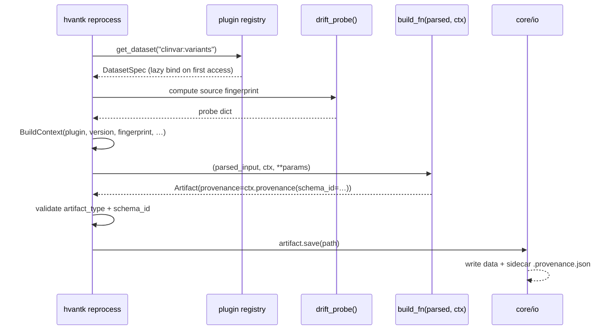

# hvantk Architecture

## Overview

`hvantk` is a multi-omics variant annotation toolkit. It is organized as a
five-package layout — four code layers (`core/`, `algorithms/`, `skills/`,
`tools/`) plus a substrate-level data registry (`resources/`) — with a
strict one-way dependency rule enforced by
[`hvantk/tests/test_dependency_directions.py`](https://github.com/bigbio/hvantk/blob/main/hvantk/tests/test_dependency_directions.py):

<p align="center">
  
</p>

`resources/` is a peer of `core/` (not a layer above it): both are
substrate that the code layers depend on, neither imports upward.
Placement rule: dataset-registry JSON, JSON schemas, and the validator /
aggregator code that operates on them go in `resources/`. Per-plugin
catalog JSON (`skills/<provider>/catalog/datasets.json`) stays with its
plugin and is aggregated by `resources/unified_registry.py`. See the
[Resources Module](#resources-module-resources) section below for the
full rule.

Design priorities:

1. **Stable contracts** — algorithms consume typed artifacts; source adapters can
   rot when upstream APIs change without breaking analysis code.
2. **Manifest-driven** — plugins declare themselves via `plugin.yaml`; the loader
   discovers descriptively first (no imports), binds executable callables lazily.
3. **Provenance everywhere** — every artifact carries a `Provenance` (plugin,
   version, source fingerprint, schema id, build timestamp, derivation parents).
4. **Backend-portable + native escape hatch** — the artifact API works on either
   Hail or pandas; algorithms that legitimately need raw Hail use
   `core_io.load_native` / `save_native` (zero-cost passthrough with provenance).

## Project Structure

```text
hvantk/
├── __main__.py            # Main CLI entry point
│
├── core/                  # L1: Core infrastructure
│   ├── config.py          # Configuration management
│   ├── constants.py       # Shared constants
│   ├── protocols.py       # Protocol definitions (Builder, Streamer, Downloader)
│   ├── builders/          # Generic builder helpers
│   │   └── table.py       # _create_table_base, _cleanup_temp_file, etc.
│   ├── io/                # Artifact loader (load/save Hail Tables, AnnData, etc.)
│   ├── models/            # Domain model types
│   │   ├── annotation_table.py  # AnnotationTable artifact
│   │   ├── expression_matrix.py # ExpressionMatrix artifact
│   │   ├── gene_set.py          # GeneSet artifact
│   │   ├── artifact.py          # Artifact base + type registry
│   │   ├── backends.py          # AlgorithmMeta, Backend, @algorithm decorator
│   │   ├── build_context.py     # BuildContext passed to plugin builders
│   │   ├── anndata_utils.py     # annotate_column_summary_ad (AnnData obs summary)
│   │   ├── metadata.py          # Metadata structs and source descriptions
│   │   └── provenance.py        # Source-fingerprint provenance stamping
│   ├── plugin/            # Plugin system
│   │   ├── api.py         # Provider, DatasetSpec, PROBE_FINGERPRINT_IGNORED_KEYS
│   │   ├── loader.py      # Plugin discovery (filesystem + entry points)
│   │   ├── run_builder.py # run_builder_for_spec() — Phase B orchestrator
│   │   └── drift_runner.py# Drift probe execution
│   └── utils/             # Cross-cutting utilities
│       ├── hail_context.py          # Idempotent Hail init
│       ├── hail_helpers.py          # create_table_base, cleanup_temp_file
│       ├── qtl_helpers.py           # GTEx variant-ID parsing (shared by eqtl/pqtl)
│       ├── bgzf.py                  # BGZF utilities
│       ├── streaming.py             # Generic DataStreamer / HailDataStreamer primitives
│       ├── gene_disease_streamer.py # Abstract base shared by clingen/cosmic-cgc/gencc
│       ├── clinvar_streamer.py      # ClinVar streamer (consumed by algorithms/)
│       ├── file_utils.py            # File I/O helpers
│       ├── gene_sets.py             # Gene set utilities
│       ├── genome.py                # Genome/contig utilities
│       ├── table_utils.py           # Hail Table manipulation helpers
│       ├── writers.py               # HailTableWriter
│       └── ...                      # Other shared utilities
│
├── algorithms/            # L4-L5: Analysis pipelines
│   ├── annotation/        # Variant annotation pipeline
│   ├── ancestry/          # Population ancestry inference
│   ├── enrichex/          # Gene set enrichment analysis
│   ├── expression/        # Expression data processing
│   ├── hgc/               # Joint genotyping (HGC) pipeline
│   ├── psroc/             # Pathogenicity score evaluation
│   ├── ptm/               # Post-translational modification analysis
│   ├── qtlcascade/        # QTL cascade analysis
│   ├── statistics/        # Statistical utilities
│   ├── training_sets/     # Training set construction
│   └── visualization/     # Shared visualization helpers
│
├── skills/                # L2-L3: Per-provider data plugins
│   ├── _conventions/      # Shared plugin contract (SKILL.md)
│   ├── _hooks/            # Plugin lifecycle hooks
│   ├── clingen/           # ClinGen gene-disease validity
│   ├── clinvar/           # ClinVar variant annotations
│   ├── cptac/             # CPTAC proteomics (expression/, phospho/)
│   ├── expression_atlas/  # Expression Atlas bulk RNA-seq
│   ├── gencc/             # GenCC gene-disease assertions
│   ├── gtex_eqtl/         # GTEx eQTL data
│   ├── gwas_catalog/      # GWAS Catalog
│   ├── hgnc/              # HGNC gene nomenclature
│   ├── insider/           # INSIDER protein-protein interaction sites
│   ├── msigdb/            # MSigDB gene sets
│   ├── peptideatlas/      # PeptideAtlas proteomics
│   ├── ucsc_cellbrowser/  # UCSC Cell Browser single-cell RNA-seq
│   └── uniprot_ptm/       # UniProt PTM annotations
│
├── tools/                 # CLI command implementations (replaces legacy commands/)
│   ├── ancestry/          # Ancestry CLI subcommands
│   ├── annotation/        # Annotation CLI subcommands
│   ├── build/             # standalone reference panel builds (1k genomes)
│   ├── enrichex/          # EnrichEx CLI subcommands
│   ├── expression/        # Expression analysis commands
│   ├── genesets/          # Gene set extraction/preparation
│   ├── hgc/               # HGC CLI subcommands
│   ├── infra/             # Installation check, BGZF validation, utils
│   ├── plugins/           # hvantk plugins / hvantk drift commands
│   ├── ptm/               # PTM CLI subcommands
│   └── qtl/               # QTL CLI subcommands
│
├── resources/             # Data catalog and schemas
│   ├── registry/          # Surviving legacy per-domain dataset metadata (genomics only)
│   ├── schemas/           # JSON schema definitions
│   └── unified_registry.py# Aggregates per-plugin catalog/datasets.json + legacy registry
│
└── tests/                 # Test suite
    ├── conftest.py        # Pytest fixtures (hail_session, etc.)
    ├── testdata/          # Test data fixtures
    ├── hgc/               # HGC tests
    ├── ancestry/          # Ancestry tests
    ├── psroc/             # PSROC tests
    ├── enrichex/          # EnrichEx tests
    └── test_*.py          # Unit and integration tests
```

## Design Principles

### 1. Domain Separation

The codebase is organized by function and biological domain:

**Data Builders** (`skills/<provider>/builder.py`):
- Each plugin under `hvantk/skills/` owns its Phase B builder
  (`build_<provider>_<dataset>`). Builders return `AnnotationTable`,
  `ExpressionMatrix`, or `GeneSet` artifacts, stamped with `Provenance` by
  the platform via `run_builder_for_spec`.
- `hvantk reprocess <provider>:<dataset>` is the **only** public build
  path. There is no separate programmatic API; in-process callers that
  need to build a table inside a tool/pipeline invoke
  `hvantk.core.plugin.run_builder.run_builder_for_spec` directly.
- Generic Hail helpers live in `hvantk/core/utils/hail_helpers.py`
  (`create_table_base`, `cleanup_temp_file`); QTL-shared helpers in
  `hvantk/core/utils/qtl_helpers.py`.

**Analysis Pipelines** (separate modules):
- `hgc/` - Joint genotyping and cohort analysis
- `ancestry/` - Population ancestry inference
- `psroc/` - Pathogenicity score evaluation
- `enrichex/` - Gene set enrichment analysis
- `ptm/` - Post-translational modification variant classification. Includes
  `constraint.py` + helpers for the stratified AF-depletion analysis
  (`hvantk ptm constraint`), a tissue/cell-type-aware complement to
  `landscape` and `population`.

**Data Product Keying**:
- **Variants** - Keyed by `(locus, alleles)`
- **Genes** - Keyed by `gene_id`
- **Proteins** - Keyed by `protein_id` or `interval`
- **Expression** - MatrixTables with rows=genes, columns=samples/cells

### 2. Artifact Contract

Every data product is one of three semantic artifact types in
[`hvantk/core/models/`](https://github.com/bigbio/hvantk/tree/main/hvantk/core/models):

| Artifact | Backends | On-disk format | Used for |
|---|---|---|---|
| `AnnotationTable` | `hail` / `pandas` | `.ht/` or `.parquet` | variants, gene-disease pairs, eQTLs, PTM sites |
| `ExpressionMatrix` | `anndata` / `hail-mt` | `.h5ad` or `.mt/` | bulk + single-cell expression, proteomics matrices |
| `GeneSet` | (in-memory `frozenset`) | `.geneset.json` | curated gene collections |

Each artifact carries a `Provenance` record (plugin, version, source
fingerprint, schema id, build timestamp, derivation `parents`). The
`@algorithm` decorator chains input provenances onto output artifacts
automatically, so the build graph is preserved end-to-end.

Artifacts expose a **portable query API** (`filter`, `select`, `join`,
`with_columns`, `group_by().agg()`) via the [`col(...)`](https://github.com/bigbio/hvantk/blob/main/hvantk/core/models/_expr.py)
expression DSL compiled to either backend at execution time. Algorithms
can be written backend-agnostically:

```python
from hvantk.core.models import AnnotationTable, col

def filter_high_impact(ann: AnnotationTable) -> AnnotationTable:
    return ann.filter((col("score") > 0.5) & (col("chrom") == "chr17"))
```

When an algorithm legitimately needs the raw native object (Hail-distributed
joins, genotype matrices), use the **native passthrough**:

```python
from hvantk.core import io as core_io

# zero-cost when backend matches file format
ht, source_prov = core_io.load_native("variants.ht")  # → hl.Table
filtered = ht.filter(ht.AC > 0)
core_io.save_native(filtered, "filtered.ht", provenance=Provenance(
    ..., parents=(source_prov,)
))
```

### 3. Plugin Contract — adding a data source

Each plugin under `hvantk/skills/<plugin>/` declares itself via `plugin.yaml`
and provides a builder that returns a typed artifact. The platform's
`run_builder_for_spec` orchestrates the build:



A minimal `plugin.yaml`:

```yaml
api_version: 2
name: my-source
version: 0.1.0
description: My data source — variant table

datasets:
  - name: variants
    domain: genomics
    backend: hail
    artifact_type: AnnotationTable
    schema_id: my-source-variants-v1
    builder:
      module: hvantk.skills.my_source.builder
      function: build_my_source_variants
    drift_probe:
      module: hvantk.skills.my_source.drift_probe
      function: fetch_fingerprint
    skill: SKILL.md
    tests:
      command: pytest hvantk/skills/my_source/tests -m hail
      fixture: tests/testdata/raw/my-source
      schema_snapshot: tests/snapshots/schema.json
      row_snapshot: tests/snapshots/sample_rows.json
      drift_fingerprint: tests/drift_fingerprint.json

cli:
  - command: my-source-download
    module: hvantk.skills.my_source.cli
    function: download_cmd
```

A matching builder:

```python
# hvantk/skills/my_source/builder.py
import hail as hl
from hvantk.core.models import AnnotationTable, BuildContext

def build_my_source_variants(parsed_input, ctx: BuildContext, **params) -> AnnotationTable:
    ht = hl.import_vcf(str(parsed_input), force=True).rows().key_by("locus", "alleles")
    return AnnotationTable.from_hail(
        ht, provenance=ctx.provenance(schema_id="my-source-variants-v1")
    )
```

The plugin loader (`hvantk/core/plugin/loader.py`) discovers manifests via a
**two-pass mechanism**:

1. **Pass 1 (descriptive, eager)** — reads YAML, populates `DatasetManifest`.
   No imports. `registry.list_manifests()` works without optional runtimes.
2. **Pass 2 (executable, lazy)** — on first `get_dataset(name)`, imports the
   builder/probe modules and caches a `DatasetSpec`. Missing optional
   runtimes only affect the *single* dataset that needs them.

Downloader CLI commands are wired automatically from the manifest's `cli:`
block — no manual edits in `hvantk/tools/plugins/download_cli.py` needed.

### Streamer placement rule

Streamers (classes that yield batches over a built table) are split by
**who consumes them**, not by which provider produced the underlying table.
This decouples streamer release cadence from provider release cadence and
keeps the one-way `skills → algorithms → tools` dependency direction
clean.

| Streamer kind | Lives in | Example |
|---|---|---|
| Generic, no domain knowledge | `core/utils/streaming.py` | `DataStreamer`, `HailDataStreamer`, `StreamProcessor` |
| Shared abstract base across sibling skills | `core/utils/` | `gene_disease_streamer.py` (used by `clingen`, `cosmic-cgc`, `gencc`) |
| Consumed by `algorithms/` | `core/utils/` | `clinvar_streamer.py` (consumed by `algorithms/annotation`, `algorithms/training_sets`) |
| Truly source-specific (only the skill itself and `tools/` consume it) | `skills/<provider>/streamer.py` | `clingen/streamer.py`, `cosmic_cgc/streamer.py`, `gencc/streamer.py`, `alphagenome/streamer.py` |

The shared-base case is the one most likely to surprise: the sibling-skill
rule (`skills/X` cannot import from `skills/Y`) forces any base class used
by multiple skills to live above the skills layer — in `core/utils/`.

### 3. CLI-First Design

The primary interface is a well-structured CLI with domain-specific commands:

```bash
# Download data
hvantk download ucsc --dataset adultPancreas --output-dir data/

# Build any dataset (full pipeline: download -> parse -> build -> drift check)
hvantk reprocess clinvar:variants --raw-dir data/ --output clinvar.ht
hvantk reprocess ucsc-cellbrowser:adultPancreas --raw-dir data/ --output ucsc.h5ad

# Joint genotyping (HGC)
hvantk hgc gvcf-combine -g /data/gvcfs -o cohort.vds
hvantk hgc compute-qc -i cohort.mt -o cohort_qc.mt
```

### 4. Data Flow Patterns

#### Pattern 1: Builder → Table
```
Raw File (VCF/TSV/BED) → Builder → Hail Table → Disk (.ht)
```

Example:
```python
# Via the plugin system (recommended)
from hvantk.core.plugin.run_builder import run_builder_for_spec

artifact = run_builder_for_spec("clinvar:variants", input_path="clinvar.vcf.bgz", output_path="clinvar.ht")
```

#### Pattern 2: Batch Building via Recipes
```
Recipe JSON → Parser → [Builder 1, Builder 2, ...] → Multiple Tables
```

Example recipe:
```json
{
  "tables": [
    {
      "name": "clinvar",
      "input": "/data/clinvar.vcf.bgz",
      "output": "/out/clinvar.ht",
      "params": {"reference_genome": "GRCh38"}
    }
  ]
}
```

#### Pattern 3: Multi-Omics Integration
```
Variant Table + Gene Table + Expression Matrix → Integrated Analysis
```

Example:
```python
# Load different data types
variants = hl.read_table('clinvar.ht')
genes = hl.read_table('ensembl.ht')
expression = hl.read_matrix_table('ucsc.mt')

# Join for integrated analysis
annotated = variants.annotate(
    gene=genes[variants.gene_id],
    expression=expression[variants.gene_id, :].expression.collect()
)
```

## Module Details

### Core Module (`core/`)

**Purpose**: Shared infrastructure used by all other modules

**Key Components**:
- `config.py` - Configuration management, context settings
- `constants.py` - Shared constants (e.g., Ensembl field definitions)
- `utils/hail_context.py` - Hail session initialization and management
- `protocols.py` - Protocol definitions for extensibility
- `models/` - Domain artifact types (`AnnotationTable`, `ExpressionMatrix`, `GeneSet`)
- `plugin/` - Plugin schema (`api.py`), discovery (`loader.py`), and builder dispatch (`run_builder.py`)

**Design principle**: No domain logic, only infrastructure

### Skills Module (`skills/`)

**Purpose**: Per-provider data plugins. Each provider folder contains `plugin.yaml`, `builder.py`, `cli.py`, `drift_probe.py`, `SKILL.md`, `catalog/datasets.json`, and `tests/`. Multi-dataset providers (e.g., `cptac/`) have one sub-folder per dataset.

**Current providers** (20): `alphagenome`, `clingen`, `clinvar`, `cosmic_cgc`, `cptac`, `dbnsfp`, `ensembl_gene`, `expression_atlas`, `gencc`, `gevir`, `gnomad_metrics`, `gtex_eqtl`, `gwas_catalog`, `hgnc`, `insider`, `msigdb`, `peptideatlas`, `pqtl`, `ucsc_cellbrowser`, `uniprot_ptm`.

**Builder outputs**:
- Variant / gene tables keyed by `(locus, alleles)` or `gene_id` → `AnnotationTable`
- Expression matrices rows=genes, columns=samples/cells → `ExpressionMatrix`
- Gene set collections → `GeneSet`

### Tools Module (`tools/`)

**Purpose**: Top-level CLI command implementations (replaces the legacy `commands/` directory)

**Key sub-packages**:
- `plugins/` - `hvantk reprocess`, `hvantk drift`, `hvantk plugins list/show/reload` commands
- `build/` - standalone reference panel builds (e.g. 1000 Genomes)
- `hgc/` - HGC joint genotyping subcommands (combine, convert, QC, pipeline)
- `ancestry/`, `enrichex/`, `ptm/`, `qtl/` - Per-pipeline CLI subcommands
- `infra/` - Installation check, BGZF validation, utils

### HGC Module (`hgc/`)

**Purpose**: High-performance joint genotyping workflows

**Features**:
- GVCF combination at scale
- Format conversion (VDS ↔ MatrixTable ↔ VCF)
- Comprehensive QC metrics and visualization
- Optimized for large cohorts (1000s of samples)

**Status**: Feature-complete, well-established module

### Resources Module (`resources/`)

**Purpose**: Substrate-level data registry and schema definitions.
Peer of `core/`, not a layer above it.

**Contents**:
- `registry/` - Surviving legacy per-domain dataset metadata (genomics only; transcriptomics / proteomics / epigenomics moved into per-plugin `hvantk/skills/<provider>/catalog/datasets.json`)
- `unified_registry.py` - `HvantkRegistry` aggregator surfaced via `hvantk catalog {list,show,stats,search}`. Reads both the legacy per-domain registry above and the per-plugin catalog JSON under `skills/<provider>/catalog/`.
- `schemas/` - JSON schema definitions used by `schema_validator.py` to validate catalog entries.
- `schema_validator.py` - Validation entry point invoked by the unified registry.

**Placement rule** (what goes here vs. nearby alternatives):

| Lives in | Use for |
|---|---|
| `resources/registry/` | Cross-plugin / legacy per-domain catalog JSON that hasn't been migrated to a per-plugin folder. |
| `resources/schemas/` | JSON schemas that describe catalog / dataset metadata, shared across plugins. |
| `resources/unified_registry.py` | Code that aggregates per-plugin catalog JSON with the legacy registry. |
| `skills/<provider>/catalog/datasets.json` | Per-plugin dataset metadata (the canonical location for new providers). |
| `core/models/` | Artifact types (`AnnotationTable`, `ExpressionMatrix`, `GeneSet`) — runtime data shapes, not catalog metadata. |

**Dependency direction**: `resources/` may be imported by `algorithms/`,
`skills/`, and `tools/`. It must NOT import from any of those — like
`core/`, it is substrate. This is enforced by
`test_resources_does_not_import_upward` in
[`hvantk/tests/test_dependency_directions.py`](https://github.com/bigbio/hvantk/blob/main/hvantk/tests/test_dependency_directions.py).

## Testing Strategy

Tests are organized to mirror the module structure:

```
hvantk/tests/
├── conftest.py        # Pytest fixtures (hail_session, etc.)
├── test_*.py          # Unit and integration tests
├── hgc/               # HGC module tests
├── ancestry/          # Ancestry module tests
├── psroc/             # PSROC module tests
├── enrichex/          # EnrichEx module tests
└── testdata/          # Test data fixtures
```

## Extension Points

### Adding a New Data Source

See the "Plugin Contract" section above for the full pattern. The minimal
checklist:

1. Create `hvantk/skills/<provider>/` with `plugin.yaml`, `builder.py` (returns
   `AnnotationTable` / `ExpressionMatrix` / `GeneSet` via `ctx.provenance(schema_id=…)`),
   `drift_probe.py`, `SKILL.md`, `catalog/datasets.json`, and `tests/`.
2. Loader picks it up automatically — no edits to `hvantk/hvantk.py` or
   `hvantk/tools/plugins/download_cli.py` required.
3. CLI downloader command is wired from the manifest's `cli:` block.
4. Add a conformance test using the `run_builder_for_spec` orchestrator
   (see `hvantk/tests/test_plugin_conformance.py` for the template).
5. Run `hvantk plugins list` — your plugin should appear.

See `hvantk/skills/_conventions/SKILL.md` for the full contract.

### Adding a New Algorithm

1. Place the algorithm body in `hvantk/algorithms/<domain>/`.
2. Decorate the entry point with `@algorithm`:
   ```python
   from hvantk.core.models.backends import Backend, algorithm

   @algorithm(
       name="my_algorithm",
       backends=[Backend.PANDAS],
       inputs={"data": "AnnotationTable", "gene_set": "GeneSet"},
       outputs={"result": "AnnotationTable"},
   )
   def my_algorithm(data, gene_set):
       ...
   ```
3. The decorator handles provenance chaining automatically. Output
   artifacts inherit `parents = (data.provenance, gene_set.provenance)`.
4. For Hail-native algorithms, declare `required_backend="hail"` and use
   `core_io.load_native` to read inputs natively.

### Adding a New CLI Command

1. Place the click command in `hvantk/tools/<domain>/`.
2. Add a `<basename>.tool.yaml` manifest for discoverability via
   `hvantk tools list` (descriptive metadata; not authoritative for
   wiring today — that's Phase Q follow-up).
3. Wire the command in `hvantk/hvantk.py`'s top-level CLI group.

## Dependencies

- **Hail** - Distributed data processing framework
- **gnomAD** - Utilities for gnomAD data
- **Click** - CLI framework
- **Pandas** - Data manipulation
- **PyYAML** - YAML recipe support
- **Matplotlib/Seaborn/Plotly** - Visualization (optional)

## Performance Considerations

- **Partitioning**: Builders use appropriate partitioning for Hail operations
- **Checkpointing**: Large intermediate results are checkpointed
- **Memory**: HGC module optimized for memory-efficient large cohort processing
- **Caching**: Hail's lazy evaluation allows for optimization

## References

- [Hail Documentation](https://hail.is/docs/0.2/)
- [gnomAD Browser](https://gnomad.broadinstitute.org/)
- [UCSC Cell Browser](https://cells.ucsc.edu/)
