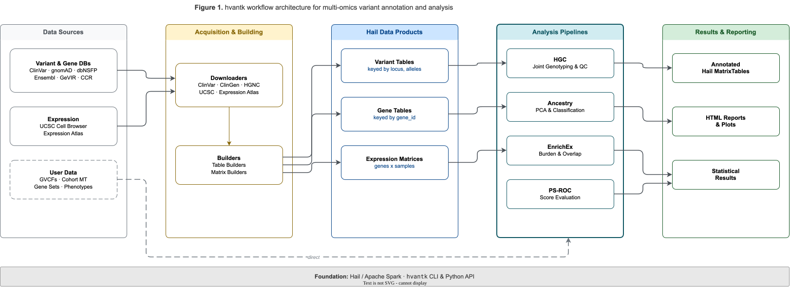

# hvantk Architecture

## Overview

`hvantk` (Hail-based Variant Annotation Toolkit) is a modular toolkit for multi-omics variant annotation and analysis built on Hail. The architecture emphasizes:

1. **Domain organization** - Separate concerns for variants, genes, proteins, and expression data
2. **Extensibility** - Protocol-based contracts for builders, streamers, and downloaders
3. **Usability** - CLI-first design with clear command structure
4. **Scalability** - Built on Hail for distributed processing of large datasets

## Architecture Diagram



**Figure 1.** *hvantk workflow architecture for scalable multi-omics variant annotation and analysis. External variant, gene, and expression databases are acquired through built-in downloaders and converted to domain-organized Hail Tables and MatrixTables via the builder framework. User cohort data (GVCFs, MatrixTables, gene sets, phenotypes) feeds directly into analysis pipelines. Four specialized pipelines — HGC (joint genotyping and quality control), Ancestry (PCA-based population inference), EnrichEx (gene-set burden and overlap testing), and PS-ROC (pathogenicity score evaluation) — produce annotated tables, HTML reports with embedded plots, and statistical results. All operations are distributed via Hail on Apache Spark, accessible through the `hvantk` CLI and Python API.*

## Project Structure

```text
hvantk/
├── hvantk.py              # Main CLI entry point
│
├── core/                  # L1: Core infrastructure
│   ├── config.py          # Configuration management
│   ├── constants.py       # Shared constants
│   ├── hail_context.py    # Hail session management (thread-safe init)
│   └── protocols.py       # Protocol definitions (Builder, Streamer, Downloader)
│
├── data/                  # L1: Data management utilities
│   ├── dataset.py         # Dataset handling
│   ├── file_utils.py      # File I/O utilities
│   └── data_streamer.py   # DataStreamer base classes & StreamProcessor
│
├── datasets/              # L2: Dataset definitions
│   ├── ucsc_cell_datasets.py        # UCSC Cell Browser datasets
│   ├── expression_atlas_datasets.py # Expression Atlas datasets
│   └── clingen_datasets.py          # ClinGen datasets
│
├── tables/                # L2-L3: Table and matrix builders
│   ├── table_builders.py  # Variant/gene annotation builders (ClinVar, dbNSFP, Ensembl, etc.)
│   ├── matrix_builders.py # Expression matrix builders
│   ├── ucsc.py            # UCSC Cell Browser builders
│   ├── expression_atlas.py# Expression Atlas builders
│   ├── cptac.py           # CPTAC proteomics builders
│   └── registry.py        # Builder registry for recipes
│
├── annotation/            # L4: Annotation pipeline
│   ├── annotate.py        # Core annotation functions
│   ├── annotation_pipeline.py # Pipeline orchestration
│   └── annotation_streamer.py # Annotation DataStreamer
│
├── hgc/                   # L5: HGC - Joint genotyping pipeline
│   ├── combiners.py       # GVCF/MT combination
│   ├── converters.py      # Format conversion (VDS ↔ MT ↔ VCF)
│   ├── qc.py              # Quality control metrics
│   ├── pipeline.py        # End-to-end pipeline orchestration
│   ├── file_utils.py      # HGC-specific file utilities
│   └── constants.py       # HGC constants
│
├── ancestry/              # L5: Ancestry inference pipeline
│   ├── pipeline.py        # End-to-end ancestry pipeline
│   ├── pca.py             # PCA computation
│   ├── classify.py        # Random Forest classification
│   ├── merge.py           # Reference/query merging
│   ├── filter.py          # Variant filtering
│   ├── plot.py            # Ancestry visualization
│   ├── report.py          # HTML report generation
│   └── constants.py       # Ancestry constants
│
├── psroc/                 # L5: PSROC - Score evaluation pipeline
│   ├── pipeline.py        # End-to-end PSROC pipeline
│   ├── roc.py             # ROC curve computation
│   └── plots.py           # ROC visualization
│
├── enrichex/              # L5: EnrichEx - Gene set enrichment
│   ├── overlap.py         # Overlap enrichment (Fisher's exact)
│   ├── burden.py          # Burden testing (rare variant regression)
│   ├── gene_sets.py       # Gene set handling
│   ├── correction.py      # Multiple testing correction
│   ├── plot.py            # Enrichment visualization
│   └── report.py          # HTML report generation
│
├── commands/              # CLI command implementations
│   ├── make_table_cli.py        # mktable commands
│   ├── make_matrix_cli.py       # mkmatrix commands
│   ├── make_table_batch_cli.py  # mktable-batch (recipes)
│   ├── make_matrix_batch_cli.py # mkmatrix-batch (recipes)
│   ├── catalog_cli.py           # Data catalog commands
│   ├── ancestry_cli.py          # Ancestry CLI
│   ├── psroc_cli.py             # PSROC CLI
│   ├── ucsc_downloader.py       # UCSC downloader
│   ├── expression_atlas_downloader.py # Expression Atlas downloader
│   ├── clingen_downloader.py    # ClinGen downloader
│   ├── hgc/                     # HGC CLI subcommands
│   │   ├── combine_cli.py       # gvcf-combine, mt-combine
│   │   ├── convert_cli.py       # vds2mt, mt2vcf
│   │   ├── qc_cli.py            # compute-qc, qc-report
│   │   └── pipeline_cli.py      # pipeline (end-to-end)
│   └── enrichex_cli/            # EnrichEx CLI subcommands
│       ├── overlap_cli.py       # overlap enrichment
│       └── burden_cli.py        # burden testing
│
├── utils/                 # Utility functions
│   ├── table_utils.py     # Table manipulation helpers
│   ├── matrix_utils.py    # MatrixTable utilities
│   ├── genome.py          # Genome/contig utilities
│   ├── gene_sets.py       # Gene set utilities
│   ├── expressions.py     # Expression data utilities
│   ├── catalog.py         # Catalog utilities
│   └── clinvar_streamer.py# ClinVar-specific streamer
│
├── visualization/         # Visualization and reporting
│   ├── base.py            # Base visualization classes
│   ├── qc_plots.py        # QC plotting functions
│   ├── qc_report.py       # QC HTML report generation
│   ├── interactive_qc.py  # Interactive QC dashboards
│   └── expression/        # Expression-specific visualizations
│       └── hail.py        # Hail-based expression plots
│
├── resources/             # Data catalog and schemas
│   ├── catalog.yaml       # Dataset registry
│   ├── registry/          # Per-domain dataset metadata
│   ├── schemas/           # JSON schema definitions
│   └── unified_registry.py# Unified registry access
│
└── tests/                 # Test suite
    ├── conftest.py        # Pytest fixtures (hail_session, etc.)
    ├── testdata/          # Test data fixtures
    ├── hgc/               # HGC tests
    ├── ancestry/          # Ancestry tests
    ├── psroc/             # PSROC tests
    └── enrichex/          # EnrichEx tests
```

## Design Principles

### 1. Domain Separation

The codebase is organized by function and biological domain:

**Data Builders** (`tables/`):
- `table_builders.py` - Variant and gene annotation builders (ClinVar, dbNSFP, Ensembl, GeVIR, etc.)
- `matrix_builders.py` - Expression matrix builders
- `ucsc.py`, `expression_atlas.py`, `cptac.py` - Source-specific builders

**Analysis Pipelines** (separate modules):
- `hgc/` - Joint genotyping and cohort analysis
- `ancestry/` - Population ancestry inference
- `psroc/` - Pathogenicity score evaluation
- `enrichex/` - Gene set enrichment analysis

**Data Product Keying**:
- **Variants** - Keyed by `(locus, alleles)`
- **Genes** - Keyed by `gene_id`
- **Proteins** - Keyed by `protein_id` or `interval`
- **Expression** - MatrixTables with rows=genes, columns=samples/cells

### 2. Protocol-Based Extensibility

Three core protocols define how components interact:

#### Builder Protocol
Converts raw data files → Hail Tables/MatrixTables

```python
from hvantk.core.protocols import Builder

class MyBuilder:
    def build(self, input_path: str, **params) -> hl.Table:
        """Convert raw file to Hail Table"""

    def validate_schema(self, ht: hl.Table) -> bool:
        """Validate output schema"""

    def get_metadata(self) -> Dict[str, Any]:
        """Return builder metadata"""
```

#### Streamer Protocol
Transforms Hail data structures (filter, join, aggregate)

```python
from hvantk.core.protocols import Streamer

class MyStreamer:
    def transform(self, input_data: hl.Table, **params) -> hl.Table:
        """Transform input data"""

    def validate_input(self, input_data: hl.Table) -> bool:
        """Validate input schema"""

    def get_metadata(self) -> Dict[str, Any]:
        """Return streamer metadata"""
```

#### Downloader Protocol
Fetches external datasets with verification

```python
from hvantk.core.protocols import Downloader
from pathlib import Path

class MyDownloader:
    def download(self, dataset_id: str, output_dir: Path, **params) -> Path:
        """Download dataset"""

    def verify_checksum(self, file_path: Path, expected: str) -> bool:
        """Verify file integrity"""

    def get_metadata(self, dataset_id: str) -> Dict[str, Any]:
        """Return dataset metadata"""
```

### 3. CLI-First Design

The primary interface is a well-structured CLI with domain-specific commands:

```bash
# Download data
hvantk ucsc-downloader --dataset adultPancreas --output-dir data/

# Build individual tables
hvantk mktable clinvar --raw-input clinvar.vcf.bgz --output-ht clinvar.ht
hvantk mktable ensembl-gene --raw-input biomart.tsv --output-ht ensembl.ht

# Build matrices
hvantk mkmatrix ucsc -e expr.tsv.bgz -m meta.tsv -o ucsc.mt

# Batch processing via recipes
hvantk mktable-batch --recipe tables.json
hvantk mkmatrix-batch --recipe matrices.json

# Joint genotyping (HGC)
hvantk hgc gvcf-combine -g /data/gvcfs -o cohort.vds
hvantk hgc compute-qc -i cohort.mt -o cohort_qc.mt
```

### 4. Data Flow Patterns

#### Pattern 1: Builder → Table
```
Raw File (VCF/TSV/BED) → Builder → Hail Table → Disk (.ht)
```

Example:
```python
from hvantk.tables.table_builders import create_clinvar_tb

ht = create_clinvar_tb(
    input_path="clinvar.vcf.bgz",
    output_path="clinvar.ht",
    reference_genome="GRCh38"
)
```

#### Pattern 2: Batch Building via Recipes
```
Recipe JSON → Parser → [Builder 1, Builder 2, ...] → Multiple Tables
```

Example recipe:
```json
{
  "tables": [
    {
      "name": "clinvar",
      "input": "/data/clinvar.vcf.bgz",
      "output": "/out/clinvar.ht",
      "params": {"reference_genome": "GRCh38"}
    }
  ]
}
```

#### Pattern 3: Multi-Omics Integration
```
Variant Table + Gene Table + Expression Matrix → Integrated Analysis
```

Example:
```python
# Load different data types
variants = hl.read_table('clinvar.ht')
genes = hl.read_table('ensembl.ht')
expression = hl.read_matrix_table('ucsc.mt')

# Join for integrated analysis
annotated = variants.annotate(
    gene=genes[variants.gene_id],
    expression=expression[variants.gene_id, :].expression.collect()
)
```

## Module Details

### Core Module (`core/`)

**Purpose**: Shared infrastructure used by all other modules

**Key Components**:
- `config.py` - Configuration management, context settings
- `constants.py` - Shared constants (e.g., Ensembl field definitions)
- `hail_context.py` - Hail session initialization and management
- `protocols.py` - Protocol definitions for extensibility

**Design principle**: No domain logic, only infrastructure

### Data Module (`data/`)

**Purpose**: Data management utilities

**Key Components**:
- `dataset.py` - Dataset handling and metadata
- `file_utils.py` - File I/O utilities (download, checksum, compression)
- `data_streamer.py` - Data streaming and transformation helpers

### Tables Module (`tables/`)

**Purpose**: Convert raw data files into Hail Tables/MatrixTables

**Current organization**:

- `table_builders.py` - All variant and gene annotation builders:
  - **ClinVar** - Variant clinical significance (VCF → Table)
  - **dbNSFP** - Missense variant prediction scores (TSV → Table)
  - **Ensembl** - Gene annotations from Biomart (TSV → Table)
  - **GeVIR** - Gene-level viability scores (TSV → Table)
  - **gnomAD Metrics** - Gene constraint metrics (TSV → Table)
  - **INSIDER** - Protein-protein interaction sites (BED → Table)

- `matrix_builders.py` - Expression matrix builders:
  - **UCSC** - Single-cell RNA-seq (TSV → MatrixTable)
  - **Expression Atlas** - Bulk RNA-seq (TSV → MatrixTable)

**Schemas**:
- Variant tables keyed by `(locus, alleles)`
- Gene tables keyed by `gene_id`
- Protein tables keyed by `interval` or `protein_id`
- Expression matrices with rows=genes, columns=samples/cells

### Commands Module (`commands/`)

**Purpose**: CLI command implementations

**Key files**:
- `make_table_cli.py` - Commands for building individual tables
- `make_matrix_cli.py` - Commands for building matrices
- `make_table_batch_cli.py` - Batch table building from recipes
- `make_matrix_batch_cli.py` - Batch matrix building from recipes
- `catalog_cli.py` - Data catalog operations
- `hgc_cli.py` - HGC joint genotyping commands

### HGC Module (`hgc/`)

**Purpose**: High-performance joint genotyping workflows

**Features**:
- GVCF combination at scale
- Format conversion (VDS ↔ MatrixTable ↔ VCF)
- Comprehensive QC metrics and visualization
- Optimized for large cohorts (1000s of samples)

**Status**: Feature-complete, well-established module

### Resources Module (`resources/`)

**Purpose**: Data catalog and schema definitions

**Contents**:
- `catalog.yaml` - Central dataset registry
- `registry/` - Per-domain dataset metadata (genomics, transcriptomics, etc.)
- `schemas/` - Schema definitions for validation

## Testing Strategy

Tests are organized to mirror the module structure:

```
tests/
├── unit/                # Unit tests for individual components
│   ├── builders/       # Builder tests
│   ├── test_core.py   # Core utilities
│   └── test_commands.py # CLI commands
│
├── integration/         # Integration tests for workflows
│   └── test_workflows.py
│
└── testdata/            # Test fixtures
    ├── raw/            # Sample raw data files
    └── expected/       # Expected output schemas
```

## Extension Points

### Adding a New Data Source

1. **Add builder to appropriate file** in `hvantk/tables/`:
   ```python
   # hvantk/tables/table_builders.py (for variants/genes)
   # OR hvantk/tables/matrix_builders.py (for expression)

   import hail as hl

   def create_my_source_tb(input_path: str, output_path: str, **kwargs) -> hl.Table:
       """
       Create a Hail Table from my data source.

       Follows the Builder protocol pattern.
       """
       # Import data
       ht = hl.import_table(input_path, ...)

       # Key appropriately (locus/alleles for variants, gene_id for genes)
       ht = ht.key_by(...)

       # Checkpoint to disk
       ht = ht.checkpoint(output_path, overwrite=kwargs.get('overwrite', False))

       return ht
   ```

2. **Add a CLI command** in `hvantk/commands/make_table_cli.py`:
   ```python
   @mktable_group.command("my-source")
   @_raw_input_opt
   @_output_ht_opt
   @_overwrite_opt
   def mktable_my_source(raw_input: str, output_ht: str, overwrite: bool):
       """Build a MySource Hail Table."""
       from hvantk.tables.table_builders import create_my_source_tb

       create_my_source_tb(
           input_path=raw_input,
           output_path=output_ht,
           overwrite=overwrite
       )
   ```

3. **Add tests** in `hvantk/tests/`:
   ```python
   def test_create_my_source_tb():
       # Test implementation
       pass
   ```

4. **Update documentation** in README.md and USAGE.md

### Adding a New Transformation

1. **Implement a streamer** following the `Streamer` protocol
2. **Add to the pipeline** (for batch processing support)
3. **Document** the transformation parameters

## Dependencies

- **Hail** - Distributed data processing framework
- **gnomAD** - Utilities for gnomAD data
- **Click** - CLI framework
- **Pandas** - Data manipulation
- **PyYAML** - YAML recipe support
- **Matplotlib/Seaborn/Plotly** - Visualization (optional)

## Performance Considerations

- **Partitioning**: Builders use appropriate partitioning for Hail operations
- **Checkpointing**: Large intermediate results are checkpointed
- **Memory**: HGC module optimized for memory-efficient large cohort processing
- **Caching**: Hail's lazy evaluation allows for optimization

## Future Directions

1. **More data sources**: Add support for additional variant/gene databases
2. **Streamers library**: Build reusable transformation components
3. **Pipeline DAGs**: Support for complex multi-step workflows
4. **Cloud integration**: Better support for S3/GCS data sources
5. **Web API**: Optional REST API for programmatic access

## References

- [Hail Documentation](https://hail.is/docs/0.2/)
- [gnomAD Browser](https://gnomad.broadinstitute.org/)
- [UCSC Cell Browser](https://cells.ucsc.edu/)
