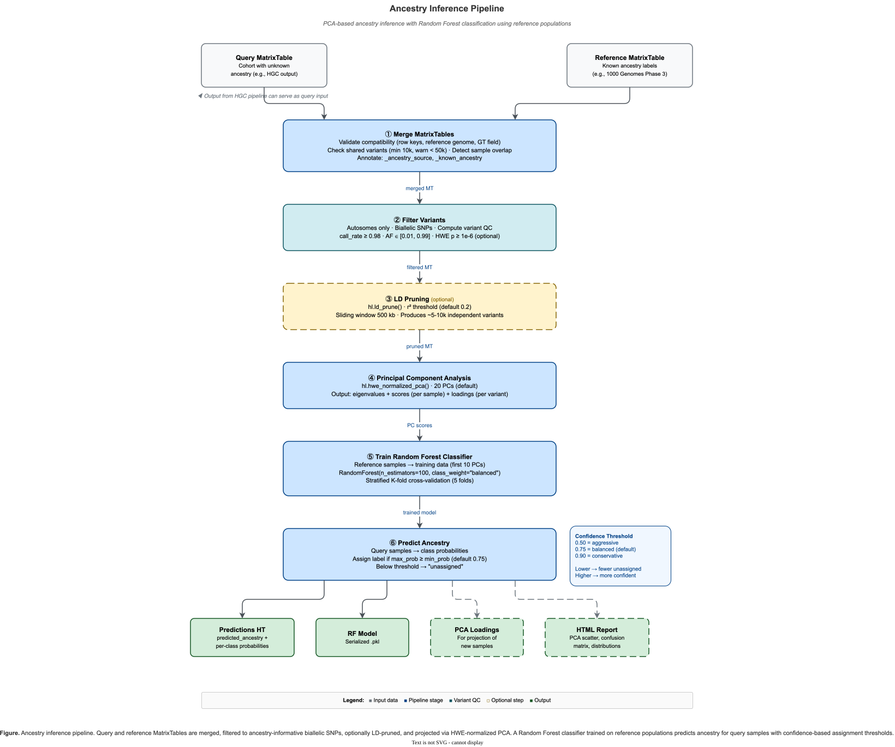

# Ancestry Inference

The ancestry inference module provides tools to predict genetic ancestry for samples using PCA-based projection and Random Forest classification against a labeled reference panel (e.g., 1000 Genomes, HapMap).



**Figure 4.** *Ancestry inference pipeline — from reference panel merge through variant filtering, LD pruning, PCA, Random Forest training, and ancestry prediction.*

## Overview

The ancestry inference pipeline follows standard population genetics practices:

1. **Merge** query cohort with labeled reference panel by shared variants
2. **Filter** to high-quality, common, biallelic SNPs on autosomes
3. **LD prune** to remove correlated variants
4. **Compute PCA** using HWE-normalized principal component analysis
5. **Train classifier** (Random Forest) on labeled reference samples
6. **Predict ancestry** for unlabeled query samples with probability thresholds

## Key Features

- **Standard Methodology**: Implements the same approach used by gnomAD and other major projects
- **Configurable Thresholds**: All filtering and classification parameters are customizable
- **Cross-Validation**: Built-in model validation with confusion matrix reporting
- **HTML Reports**: Comprehensive reports with PCA plots, ancestry distributions, and metrics
- **Probability Thresholds**: Samples below confidence threshold are marked "unassigned"
- **CLI and Python API**: Use via command-line or directly in Python scripts

## Quick Start

### Command-Line Interface

```bash
# Basic usage
hvantk ancestry-inference \
  -q cohort.mt \
  -r 1kg_reference.mt \
  --ancestry-col super_pop \
  -o ancestry_predictions.ht

# With HTML report and TSV export
hvantk ancestry-inference \
  -q cohort.mt \
  -r 1kg_reference.mt \
  --ancestry-col super_pop \
  -o ancestry_predictions.ht \
  --generate-report \
  --export-tsv

# Conservative assignment (higher confidence threshold)
hvantk ancestry-inference \
  -q cohort.mt \
  -r 1kg_reference.mt \
  --ancestry-col super_pop \
  -o ancestry_predictions.ht \
  --min-prob 0.90 \
  --generate-report
```

### Python API

```python
import hail as hl
from hvantk.ancestry import run_ancestry_inference

# Initialize Hail
hl.init()

# Load data
query_mt = hl.read_matrix_table("cohort.mt")
reference_mt = hl.read_matrix_table("1kg_reference.mt")

# Run inference
result = run_ancestry_inference(
    query_mt=query_mt,
    reference_mt=reference_mt,
    ancestry_col="super_pop",
    min_prob=0.75,
)

# Get predictions as DataFrame
predictions = result.get_predictions_df()
print(predictions['predicted_ancestry'].value_counts())

# Generate HTML report
result.generate_report("ancestry_report.html")

# Plot PCA
fig = result.plot_pca()
fig.savefig("pca_plot.png", dpi=300)

# Annotate original MatrixTable with predictions
annotated_mt = result.annotate_matrixtable(query_mt)
```

## Algorithm Details

### Step 1: MatrixTable Merging

The pipeline performs an inner join on variants present in both query and reference MatrixTables:

- Variants are matched by `(locus, alleles)` key
- Samples are annotated with source ("query" or "reference")
- Reference samples retain their known ancestry labels

**Validation checks:**
- Same reference genome (GRCh37 or GRCh38)
- Compatible row key structure
- Sufficient shared variants (default: 10,000 minimum)

### Step 2: Variant Filtering

Variants are filtered to retain high-quality, informative markers:

| Filter | Default | Rationale |
| ------ | ------- | --------- |
| Autosomes only | chr1-22 | Avoid sex chromosome complications |
| Biallelic | 2 alleles | Simplify analysis |
| SNPs only | `is_snp()` | More reliable than indels |
| Call rate | >= 98% | Ensure data quality |
| Minor allele frequency | 1-99% | Common variants informative for ancestry |
| HWE (optional) | p > 1e-6 | Remove potential genotyping errors |

### Step 3: LD Pruning

Linkage disequilibrium pruning removes correlated variants:

- Default r2 threshold: 0.2
- Default window size: 500 kb
- Typically reduces to 50,000-200,000 independent variants

### Step 4: PCA Computation

HWE-normalized PCA captures population structure:

- Uses `hl.hwe_normalized_pca()` (Patterson et al., 2006)
- Default: 20 PCs computed, 10 used for classification
- Loadings saved for future sample projection

### Step 5: Random Forest Classification

A Random Forest classifier is trained on reference samples:

- Features: First N principal components (default: 10)
- Class balancing: Automatic weighting for imbalanced populations
- Cross-validation: 5-fold stratified CV (optional)

### Step 6: Ancestry Prediction

Predictions are made with probability thresholds:

| Threshold | Behavior |
| --------- | -------- |
| 0.50 | Aggressive; may misclassify admixed individuals |
| 0.75 | Balanced (default) |
| 0.90 | Conservative; more "unassigned" but higher confidence |

Samples with max probability below threshold are labeled "unassigned".

## CLI Reference

```text
hvantk ancestry-inference [OPTIONS]

Options:
  Required:
    -q, --query-mt PATH          Path to query MatrixTable
    -r, --reference-mt PATH      Path to reference MatrixTable with labels
    -o, --output-ht PATH         Output path for predictions Table

  Reference Panel:
    --ancestry-col TEXT          Column with ancestry labels [default: ancestry]

  Output:
    --output-dir PATH            Directory for additional outputs
    --generate-report            Generate HTML report with visualizations
    --export-tsv                 Export predictions as TSV file
    --save-model                 Save trained RF model (pickle)
    --save-loadings              Save PCA loadings for projection

  Variant Filtering:
    --min-af FLOAT               Minimum allele frequency [default: 0.01]
    --max-af FLOAT               Maximum allele frequency [default: 0.99]
    --min-call-rate FLOAT        Minimum variant call rate [default: 0.98]
    --apply-hwe-filter           Apply Hardy-Weinberg equilibrium filter
    --hwe-p FLOAT                HWE p-value threshold [default: 1e-6]

  LD Pruning:
    --ld-r2 FLOAT                LD pruning r2 threshold [default: 0.2]
    --ld-window INTEGER          LD pruning window in bp [default: 500000]
    --skip-ld-pruning            Skip LD pruning step

  PCA:
    --n-pcs INTEGER              Number of PCs to compute [default: 20]
    --n-pcs-classify INTEGER     Number of PCs for classification [default: 10]

  Classification:
    --n-estimators INTEGER       Number of RF trees [default: 100]
    --min-prob FLOAT             Min probability for assignment [default: 0.75]
    --seed INTEGER               Random seed [default: 42]

  Validation:
    --skip-validation            Skip cross-validation of model
    --n-cv-folds INTEGER         Number of CV folds [default: 5]

  Checkpointing:
    --checkpoint-path PATH       Path for intermediate checkpoints
    --overwrite                  Overwrite existing outputs

  Logging:
    --log-level [DEBUG|INFO|WARNING|ERROR]
                                 Logging level [default: INFO]
```

## Input Requirements

### Query MatrixTable

- Standard Hail MatrixTable with genotype calls
- Row key: `(locus, alleles)`
- Entry field: `GT` (or `LGT` for split multi-allelics)
- Column key: sample ID (`s`)

### Reference MatrixTable

- Same structure as query MT
- Must have ancestry label column annotation
- Labels should be categorical (e.g., "EUR", "AFR", "EAS", "SAS", "AMR")
- Recommend >=30 samples per population

### Supported Reference Panels

| Panel | Populations | Samples | Notes |
| ----- | ----------- | ------- | ----- |
| 1000 Genomes Phase 3 | 5 super-populations | 2,504 | Widely used standard |
| HapMap Phase 3 | 11 populations | 1,184 | Curated for pop-gen |
| gnomAD | 8 populations | Variable | WES/WGS specific |

## Output Format

### Predictions Hail Table

```text
Schema:
  Row key: 's' (sample ID)
  Row fields:
    - predicted_ancestry: str      Population label or "unassigned"
    - ancestry_probability: float  Max class probability
    - prob_<POP>: float            Per-population probabilities
    - PC1...PCn: float             Principal component scores
    - _ancestry_source: str        "query" or "reference"
    - _known_ancestry: str         Original label (reference only)
```

### Additional Outputs

| File | Description |
| ---- | ----------- |
| `predictions.tsv` | TSV export (with `--export-tsv`) |
| `ancestry_report.html` | HTML report (with `--generate-report`) |
| `rf_model.pkl` | Trained model (with `--save-model`) |
| `pca_loadings.ht` | PCA loadings (with `--save-loadings`) |
| `pipeline_stats.json` | Pipeline statistics |

### HTML Report Contents

The HTML report includes:

1. **Summary Cards**: Sample counts, populations, shared variants
2. **Ancestry Distribution**: Bar chart and table of predictions
3. **PCA Visualization**: Two-panel plot (full view + zoomed cluster)
4. **Model Performance**: Cross-validation accuracy, confusion matrix
5. **Probability Distribution**: Histogram of prediction probabilities
6. **Sample Predictions**: Table of top predictions
7. **Configuration**: All pipeline parameters

## Python API Reference

### Main Function

```python
from hvantk.ancestry import run_ancestry_inference, PipelineConfig

result = run_ancestry_inference(
    query_mt: hl.MatrixTable,
    reference_mt: hl.MatrixTable,
    ancestry_col: str = "ancestry",
    config: PipelineConfig = None,
    **kwargs,
) -> AncestryInferenceResult
```

### AncestryInferenceResult Methods

```python
# Data access
result.get_predictions_df() -> pd.DataFrame
result.get_scores_df() -> pd.DataFrame
result.get_query_predictions() -> pd.DataFrame
result.get_reference_predictions() -> pd.DataFrame
result.get_accuracy() -> float

# Visualization
result.plot_pca(pc_x=1, pc_y=2, **kwargs) -> Figure
result.plot_pca_panel(**kwargs) -> Figure
result.plot_ancestry_proportions(**kwargs) -> Figure
result.plot_probability_distribution(**kwargs) -> Figure
result.plot_variance_explained(n_pcs=10) -> Figure
result.plot_confusion_matrix(normalize=True) -> Figure

# Output
result.generate_report(output_path, title="...") -> Path
result.save(output_path, save_model=True, save_loadings=True) -> Dict

# MatrixTable annotation
result.annotate_matrixtable(mt) -> hl.MatrixTable
```

### PipelineConfig

```python
from hvantk.ancestry import PipelineConfig

config = PipelineConfig(
    # Variant filtering
    min_af=0.01,
    max_af=0.99,
    min_call_rate=0.98,
    apply_hwe_filter=False,
    hwe_p_threshold=1e-6,

    # LD pruning
    ld_r2=0.2,
    ld_window=500000,
    skip_ld_pruning=False,

    # PCA
    n_pcs=20,

    # Classification
    n_pcs_classify=10,
    n_estimators=100,
    min_prob=0.75,
    random_seed=42,

    # Validation
    validate_model=True,
    n_cv_folds=5,

    # Checkpointing
    checkpoint_path=None,
    overwrite_checkpoints=False,
)
```

## Examples

### Example 1: Basic Ancestry Inference

```python
import hail as hl
from hvantk.ancestry import run_ancestry_inference

hl.init()

# Load data
query_mt = hl.read_matrix_table("my_cohort.mt")
reference_mt = hl.read_matrix_table("1kg_phase3.mt")

# Run with defaults
result = run_ancestry_inference(
    query_mt=query_mt,
    reference_mt=reference_mt,
    ancestry_col="super_pop",
)

# Print summary
print(result.prediction_summary())
# {'EUR': 450, 'AFR': 230, 'EAS': 180, 'SAS': 90, 'unassigned': 50}

# Save results
result.save("output/ancestry")
```

### Example 2: Conservative Assignment

```python
# Use higher probability threshold for more confident assignments
result = run_ancestry_inference(
    query_mt=query_mt,
    reference_mt=reference_mt,
    ancestry_col="super_pop",
    min_prob=0.90,  # Higher threshold
    n_pcs_classify=15,  # More PCs
)

# Check unassigned rate
predictions = result.get_query_predictions()
unassigned_rate = (predictions['predicted_ancestry'] == 'unassigned').mean()
print(f"Unassigned rate: {unassigned_rate:.1%}")
```

### Example 3: Custom Visualization

```python
# Create custom PCA plot
fig = result.plot_pca(
    pc_x=1,
    pc_y=2,
    show_query_as_undefined=True,  # Show query as "Undefined"
    figsize=(12, 10),
    alpha=0.8,
)
fig.savefig("pca_custom.png", dpi=300)

# Two-panel plot (full + zoomed)
fig = result.plot_pca_panel(filter_population="EUR")
fig.savefig("pca_panel.png", dpi=300)
```

### Example 4: Using with Downstream Analysis

```python
# Annotate original MatrixTable with ancestry
annotated_mt = result.annotate_matrixtable(query_mt)

# Filter to European samples
eur_mt = annotated_mt.filter_cols(
    annotated_mt.predicted_ancestry == "EUR"
)

# Run ancestry-stratified GWAS
# ... continue with analysis
```

## Troubleshooting

### Common Issues

#### "No shared variants between query and reference"

- Ensure both MTs use the same reference genome
- Check that variants are normalized (left-aligned, trimmed)
- Verify row keys are `(locus, alleles)`

#### "Only N shared variants; need at least 10,000"

- Your cohort may have been genotyped on a different platform
- Consider using a more compatible reference panel
- Use `--min-shared-variants` to lower the threshold (not recommended)

#### "Population X has only N samples (need 10)"

- Reference panel may have insufficient samples for some populations
- Consider merging similar populations or excluding sparse ones

#### Many samples marked "unassigned"

- May indicate admixed individuals
- Try lowering `--min-prob` threshold
- Check if query cohort matches reference panel populations

#### Cross-validation accuracy is low

- Reference panel populations may overlap in PC space
- Try using more PCs (`--n-pcs-classify 15`)
- Some populations are inherently difficult to separate

### Performance Tips

1. **Use checkpointing** for large datasets: `--checkpoint-path /tmp/ancestry`
2. **Skip LD pruning** if variants are pre-filtered: `--skip-ld-pruning`
3. **Reduce PCs** if memory is limited: `--n-pcs 10`

## References

1. Patterson N, Price AL, Reich D. (2006). Population structure and eigenanalysis. *PLoS Genet.* 2(12):e190.
2. Price AL, et al. (2006). Principal components analysis corrects for stratification in genome-wide association studies. *Nat Genet.* 38(8):904-9.
3. 1000 Genomes Project Consortium. (2015). A global reference for human genetic variation. *Nature.* 526(7571):68-74.

## See Also

- [HGC Joint Genotyping](hgc.md) - Joint genotyping pipeline
- [Usage Examples](../guide/usage.md) - General usage documentation
- [Architecture](../architecture.md) - Project architecture

---

See [Installation](../getting-started/installation.md) for setup, [Contributing](../contributing.md) for development workflow.
