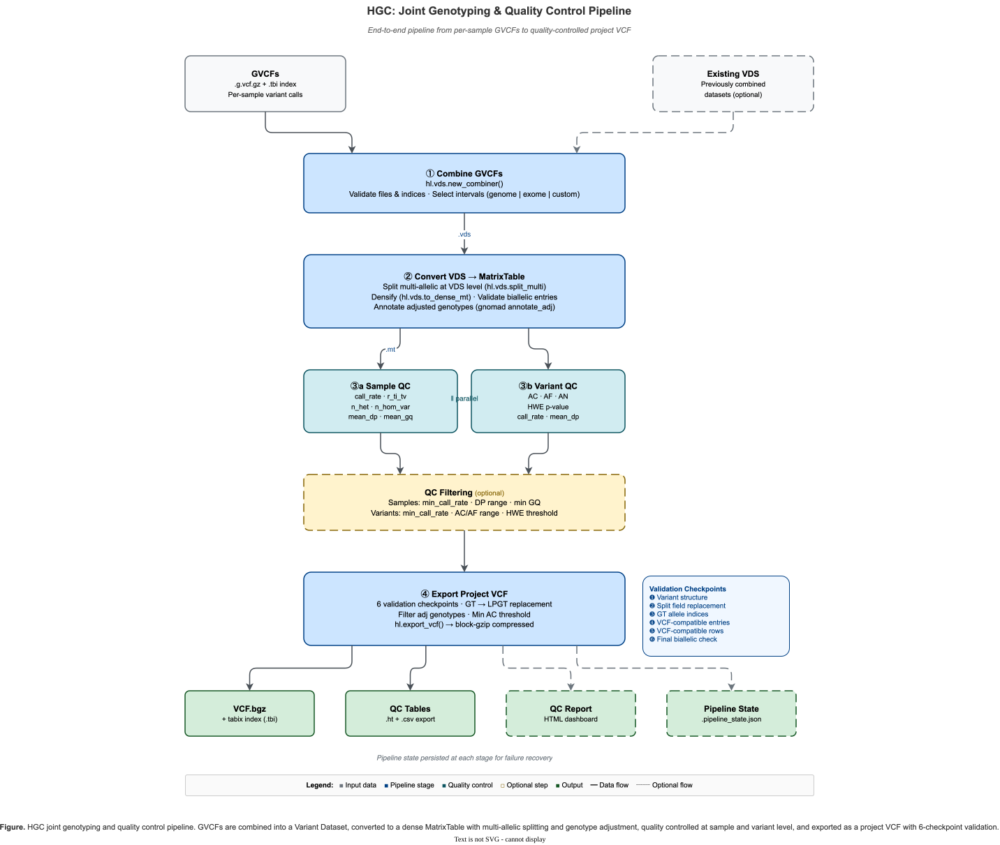

# HGC: Hail-based Genotype Combiner

HGC is a module within hvantk that provides high-performance tools for joint genotyping workflows using [Hail](https://hail.is/). It enables efficient combination of genomic variant call format (GVCF) files, conversion between different Hail data formats (VDS, MatrixTable), and export to standard VCF format.



**Figure 1.** *HGC joint genotyping pipeline — from GVCF combination through format conversion, quality control, and validated VCF export.*

## Overview

The HGC module implements a complete joint genotyping pipeline with integrated quality control:

### Primary Functionality

**Pipeline Orchestration** (Recommended)
- **End-to-End Automation** - Single command runs gVCF → VDS → MT → QC → pVCF workflow
- **Flexible Resumption** - Skip completed stages to resume from any point
- **Integrated QC** - Optional quality filtering and HTML report generation
- **State Persistence** - Automatic checkpointing for error recovery

**Individual Component Commands** (Advanced)

1. **GVCF Combination** - Combine multiple single-sample GVCF files into a unified Variant DataSet (VDS)
2. **VDS Operations** - Merge multiple VDS datasets and convert between formats
3. **MatrixTable Processing** - Convert VDS to analysis-ready MatrixTable format
4. **VCF Export** - Export processed data back to standard VCF format

### Additional Functionality: Quality Control & Visualization
5. **QC Metrics Computation** - Comprehensive sample and variant quality assessment on combined cohorts
6. **QC Visualization** - Static and interactive plots for quality control analysis
7. **QC Reports** - Professional HTML reports with embedded plots and recommendations
8. **QC-based Filtering** - Quality-based sample and variant filtering tools

## Key Features

### Pipeline Orchestration
- **Single-Command Workflows**: Run complete gVCF → pVCF pipeline with one command
- **Smart Resumption**: Skip completed stages to recover from errors or resume processing
- **Integrated QC**: Built-in quality filtering and HTML report generation
- **State Management**: Automatic checkpointing with JSON state files
- **Dry-Run Mode**: Preview execution plan before running

### Core Joint Genotyping Features
- **Scalable Joint Genotyping**: Efficiently combine thousands of GVCF files using Hail's optimized combiner
- **Flexible Data Formats**: Work with VDS (storage-optimized) and MatrixTable (analysis-optimized) formats
- **Multi-allelic Handling**: Automatic splitting and normalization of multi-allelic variants
- **Genotype Annotation**: Built-in support for adjusted genotype annotations

### Quality Control Features (Post-Combination)
- **Comprehensive QC Metrics**: Sample and variant-level quality assessment for combined cohorts
- **Interactive Visualizations**: Static matplotlib and interactive Plotly plots for data exploration
- **Professional Reports**: HTML reports with embedded plots, metrics, and recommendations
- **Quality-based Filtering**: Threshold-based sample and variant filtering tools

### Interface Options
- **CLI and Python API**: Use via command-line interface or directly in Python scripts

## Quick Start

### Command-Line Interface

#### End-to-End Pipeline (Recommended)

For most users, the **pipeline command** provides the easiest way to run the complete workflow:

```bash
# Run complete pipeline: gVCF → VDS → MT → QC → VCF
hvantk hgc pipeline \
  -i /path/to/gvcfs \
  -o /path/to/output

# With QC filtering and HTML report
hvantk hgc pipeline \
  -i /path/to/gvcfs \
  -o /path/to/output \
  --apply-qc-filters \
  --min-sample-call-rate 0.95 \
  --generate-qc-report

# View execution plan without running
hvantk hgc pipeline \
  -i /path/to/gvcfs \
  -o /path/to/output \
  --dry-run
```

See [Pipeline Orchestration](#pipeline-orchestration) for detailed documentation.

#### Tuning combiner parallelism (`--import-interval-size`)

Hail's gVCF combiner partitions the import by **even genomic intervals**, and derives
**one partition per interval**. The interval size therefore sets a *ceiling* on how many
cores can do useful work in the combine stage — the stage that dominates joint-genotyping
runtime.

The default is Hail's genome default of **1.2 Mb**, which is sized for whole-genome gVCFs.
For a **region-restricted** run (a single chromosome, an exome, a gene panel) it can
produce far fewer partitions than you have cores, leaving most of them idle:

| Input region | Partitions at the 1.2 Mb default |
|---|---|
| chr20 (64.4 Mb) | 54 |
| chr1 (249.0 Mb) | 208 |
| whole genome (3.1 Gb) | ~2,584 |

**Rule of thumb: keep partitions at roughly 2–4× your total core count.** If you run
chr20 on 128 cores with the default, ~74 cores have nothing to do — which looks like
"the tool doesn't scale" but is purely a partitioning artefact.

```bash
# chr1 on a 128-core cluster: 600 kb -> 415 partitions (~3x cores)
hvantk hgc gvcf-combine -g /path/to/chr1_gvcfs -o cohort.vds \
    --import-interval-size 600000

# The same knob on the recommended end-to-end pipeline
hvantk hgc pipeline -i /path/to/chr1_gvcfs -o /path/to/out \
    --import-interval-size 600000
```

Related tuning options (available on both `gvcf-combine` and `pipeline`):

| Option | Meaning | Hail default |
|---|---|---|
| `--import-interval-size` | Interval size (bp); **one partition per interval** | 1.2 Mb (genome) |
| `--use-exome-default-intervals` | Use Hail's exome interval size | 60 Mb |
| `--gvcf-batch-size` | gVCFs merged per tree-merge batch | 50 |
| `--branch-factor` | Branch factor of the hierarchical merge | 100 |

`--import-interval-size` and `--use-exome-default-intervals` are mutually exclusive.

#### Individual Component Commands

For advanced users who need fine-grained control, HGC provides individual commands:

**Core Joint Genotyping Commands:**

```bash
# View available commands
hvantk hgc --help

# Combine GVCF files
hvantk hgc gvcf-combine -g /path/to/gvcfs -o combined.vds

# Combine VDS datasets
hvantk hgc vds-combine -i /path/to/vds_dir -o merged.vds

# Convert VDS to MatrixTable
hvantk hgc vds2mt -i combined.vds -o analysis.mt

# Export MatrixTable to VCF
hvantk hgc mt2vcf -i analysis.mt -o results.vcf.gz
```

**Quality Control Commands (Post-Combination):**

Additional QC commands for analyzing combined cohorts:

```bash
# Compute QC metrics for combined cohort
hvantk hgc compute-qc -i analysis.mt -o analysis_qc.mt

# Generate QC visualizations
hvantk hgc plot-qc -i analysis_qc.mt -o plots/ --plot-type dashboard

# Create interactive QC plots
hvantk hgc plot-qc -i analysis_qc.mt -o plots/ --interactive

# Generate comprehensive QC report
hvantk hgc qc-report -i analysis_qc.mt -o qc_report.html

# Filter based on QC metrics
hvantk hgc filter-qc -i analysis_qc.mt -o filtered.mt --min-sample-call-rate 0.95
```

### Python API

#### Core Joint Genotyping Functions

Use HGC functions directly in Python:

```python
from hvantk.algorithms.hgc import (
    combine_gvcfs,
    combine_vdses,
    convert_vds_to_mt,
    convert_mt_to_multi_sample_vcf
)

# Combine GVCF files into VDS
combine_gvcfs(
    gvcf_dir="/path/to/gvcfs",
    vds_output_path="output.vds",
    tmp_path="/tmp/hail",
    save_path="combiner_plan.json",
    vdses=[],
    kwargs={}
)

# Convert VDS to MatrixTable
convert_vds_to_mt(
    vds_path="output.vds",
    output_path="analysis.mt",
    adjust_genotypes=True,
    skip_split_multi=False,
    skip_validation=False
)
```

#### Quality Control Functions (Post-Combination)

Additional QC functionality for combined cohorts:

```python
from hvantk.algorithms.hgc import compute_full_qc, filter_samples_by_qc, filter_variants_by_qc

# Load combined MatrixTable
import hail as hl
mt = hl.read_matrix_table("analysis.mt")

# Compute comprehensive QC metrics
qc_results = compute_full_qc(mt)

# Generate visualizations
qc_results.plot_interactive_dashboard().show()
qc_results.generate_html_report('qc_report.html')

# Apply quality filters
mt_filtered = filter_samples_by_qc(
    qc_results.mt,
    min_call_rate=0.95,
    min_ti_tv_ratio=1.8
)

mt_filtered = filter_variants_by_qc(
    mt_filtered,
    min_call_rate=0.90,
    min_hwe_pvalue=1e-6
)
```

#### Pipeline Orchestration (Recommended)

For end-to-end workflows, use the Pipeline API:

```python
from hvantk.algorithms.hgc.pipeline import PipelineConfig, PipelineRunner

# Create configuration
config = PipelineConfig(
    input_dir="/data/gvcfs",
    output_dir="/data/output",
    apply_qc_filters=True,
    min_sample_call_rate=0.95,
    generate_qc_report=True
)

# Run pipeline
runner = PipelineRunner(config)
runner.show_plan()  # Optional: preview execution
state = runner.run()

# Check results
print(f"Outputs: {state.outputs}")
```

See [Pipeline Orchestration](#pipeline-orchestration) for detailed documentation.

## Core Components

### 1. Pipeline (`hvantk.algorithms.hgc.pipeline`)

**Recommended** - End-to-end workflow orchestration:

- **`PipelineConfig`** - Configuration dataclass with validation
- **`PipelineRunner`** - Orchestration engine with dry-run support
- **`PipelineState`** - State tracking with JSON save/load
- **`PipelineStage`** - Enum of pipeline stages

See [Pipeline Orchestration](#pipeline-orchestration) for detailed usage.

### 2. Combiners (`hvantk.algorithms.hgc.combiners`)

Functions for combining genomic datasets:

- **`combine_gvcfs()`** - Combine GVCF files and/or existing VDS datasets into a new VDS
- **`combine_vdses()`** - Merge multiple VDS directories into a single VDS

**Advanced functions** (require direct import from `hvantk.algorithms.hgc.combiners`):
- **`combine_matrix_table_rows()`** - Combine MatrixTables by rows (variants)
- **`combine_matrix_table_cols()`** - Combine MatrixTables by columns (samples)

### 3. Converters (`hvantk.algorithms.hgc.converters`)

Functions for format conversion:

- **`convert_vds_to_mt()`** - Convert VDS to dense MatrixTable format
- **`convert_mt_to_multi_sample_vcf()`** - Export MatrixTable to multi-sample VCF

### 4. File Utilities (`hvantk.algorithms.hgc.file_utils`)

Helper functions for file handling:

- **`validate_vcfs_paths()`** - Validate GVCF files and their indices
- **`validate_vds_paths()`** - Validate VDS directory paths
- **`check_path_exists_and_readable()`** - Verify file accessibility
- **`compress_files()`** / **`decompress_files()`** - Handle file compression
- **`sort_mts_cols()`** - Sort MatrixTable columns to match reference order

## Detailed Usage

### GVCF Combination

Combine single-sample GVCF files into a joint-called VDS:

**CLI:**
```bash
hvantk hgc gvcf-combine \
  --gvcf-dir /data/gvcfs \
  --output cohort.vds \
  --temp-dir /tmp/hail \
  --save-path combiner_plan.json
```

**Python:**
```python
from hvantk.algorithms.hgc import combine_gvcfs

combine_gvcfs(
    gvcf_dir="/data/gvcfs",
    vds_output_path="cohort.vds",
    tmp_path="/tmp/hail",
    save_path="combiner_plan.json",
    vdses=[],  # Optional: existing VDS to include
    kwargs={
        # Optional interval parameters (mutually exclusive):
        # 'use_genome_default_intervals': True,
        # 'use_exome_default_intervals': True,
        # 'intervals': [list of intervals]
    },
    reference_genome="GRCh38"
)
```

**Parameters:**
- `gvcf_dir`: Directory containing `.g.vcf.gz` files with `.tbi` indices
- `vds_output_path`: Output path for the combined VDS
- `tmp_path`: Temporary directory for intermediate files
- `save_path`: Path to save the combiner execution plan (JSON)
- `vdses`: List of existing VDS paths to combine with GVCFs
- `kwargs`: Additional parameters for `hail.vds.new_combiner()`
- `reference_genome`: Reference genome build (default: "GRCh38")

**Requirements:**
- GVCF files must have corresponding `.tbi` index files
- Sufficient temporary storage (typically 2-3x input size)
- Adequate memory for Hail operations

### VDS Combination

Merge multiple VDS datasets:

**CLI:**
```bash
hvantk hgc vds-combine \
  --input-dir /data/vds_datasets \
  --output merged.vds \
  --validate \
  --overwrite
```

**Python:**
```python
from hvantk.algorithms.hgc import combine_vdses

combine_vdses(
    vdses_dir="/data/vds_datasets",
    output_path="merged.vds",
    validate=True,
    overwrite=False
)
```

**Parameters:**
- `vdses_dir`: Directory containing VDS subdirectories (each ending in `.vds`)
- `output_path`: Output path for merged VDS
- `validate`: Whether to validate the combined VDS using Hail's validator
- `overwrite`: Whether to overwrite existing output

### VDS to MatrixTable Conversion

Convert storage-optimized VDS to analysis-ready MatrixTable:

**CLI:**
```bash
hvantk hgc vds2mt \
  --input cohort.vds \
  --output analysis.mt \
  --adjust-genotypes \
  --overwrite
```

**Python:**
```python
from hvantk.algorithms.hgc import convert_vds_to_mt

convert_vds_to_mt(
    vds_path="cohort.vds",
    output_path="analysis.mt",
    adjust_genotypes=True,
    skip_split_multi=False,
    skip_validation=False,
    skip_keying_by_cols=False,
    overwrite=False
)
```

**Parameters:**
- `vds_path`: Input VDS path
- `output_path`: Output MatrixTable path
- `adjust_genotypes`: Annotate with adjusted genotypes using gnomAD quality filters (requires `gnomad` package)
- `skip_split_multi`: Skip splitting multi-allelic variants (not recommended)
- `skip_validation`: Skip the biallelic audit and genotype repair (see below)
- `skip_keying_by_cols`: Skip keying MatrixTable by sample column
- `overwrite`: Whether to overwrite existing output

**Important Notes:**
- The VDS-level split already produces biallelic GT/AD — no manual LGT→GT downcoding is needed
- Adjusted genotype annotation requires the `gnomad` package: `pip install gnomad`

#### The densify runs exactly once

This stage is dominated by *densification*: expanding the VDS's reference blocks back into a full
samples × sites matrix. Hail is lazy and **does not cache**, so every *eager* action on the dense
MatrixTable — an `aggregate_entries`, a `count`, a `write` — re-executes the whole densify from
the top.

`convert_vds_to_mt` is therefore written so that **only the final `write` touches the dense
matrix**:

- the **biallelic audit** (out-of-bounds `GT` indices, `AD` length mismatches) runs on the *sparse*
  `variant_data`, before densification. That is where such defects can originate: reference blocks
  are hom-ref by construction and carry no `AD`, so densification cannot introduce either defect.
- the **repair** (setting an out-of-bounds genotype to missing) is applied as a lazy, unconditional
  expression on the dense matrix. It fuses into the write, and on clean data it is the identity.

Gating the repair behind `if n_invalid > 0` would look harmless but is not: *reading* that count is
an eager action, so it forces an entire extra densify of the cohort. On a 500-sample chr1 callset
that mistake cost ~42% of the stage's wall time.

`--skip-validation` turns off both the audit and the repair. The audit is cheap (it scans only the
sparse variant records), so there is rarely a reason to.

### MatrixTable to VCF Export

Export processed MatrixTable to standard VCF format:

**CLI:**
```bash
hvantk hgc mt2vcf \
  --input analysis.mt \
  --output results.vcf.gz \
  --filter-adj \
  --min-ac 1 \
  --split-multi
```

**Python:**
```python
from hvantk.algorithms.hgc import convert_mt_to_multi_sample_vcf

convert_mt_to_multi_sample_vcf(
    mt_path="analysis.mt",
    vcf_path="results.vcf.gz",
    filter_adj_genotypes=True,
    min_ac=1,
    split_multi=True
)
```

**Parameters:**
- `mt_path`: Input MatrixTable path
- `vcf_path`: Output VCF file path
- `filter_adj_genotypes`: Filter to adjusted genotypes only (recommended)
- `min_ac`: Minimum alternate allele count for variant inclusion
- `split_multi`: Split multi-allelic variants (if not already split)

**VCF Info Fields:**
The output VCF includes standard INFO fields:
- `AF`: Allele frequency
- `AC`: Allele count
- `AN`: Total number of alleles
- `call_rate`: Variant call rate

## Pipeline Orchestration

The **HGC Pipeline** provides end-to-end workflow orchestration from gVCF files to cohort VCF with integrated quality control. This is the **recommended approach** for most users.

### Overview

The pipeline orchestrates five stages:

1. **Combine gVCFs** → VDS (Variant Dataset)
2. **Convert VDS** → MatrixTable
3. **Compute Sample QC** metrics
4. **Compute Variant QC** metrics
5. **Export** → Project VCF (pVCF)

Each stage can be skipped for flexible workflow resumption.

### Basic Usage

```bash
# Run complete pipeline
hvantk hgc pipeline \
  -i /data/gvcfs \
  -o /data/output

# With QC filtering and reporting
hvantk hgc pipeline \
  -i /data/gvcfs \
  -o /data/output \
  --apply-qc-filters \
  --min-sample-call-rate 0.95 \
  --min-variant-call-rate 0.90 \
  --generate-qc-report

# View execution plan (dry run)
hvantk hgc pipeline \
  -i /data/gvcfs \
  -o /data/output \
  --dry-run
```

### Key Features

- **End-to-End Automation**: Single command runs the complete workflow
- **Stage Skipping**: Resume from any intermediate stage
- **QC Integration**: Optional quality filtering before export
- **State Persistence**: Automatic checkpointing for recovery
- **Flexible Configuration**: 20+ options for customization

### Common Workflows

#### 1. Standard Pipeline with QC

```bash
hvantk hgc pipeline \
  -i /data/gvcfs \
  -o /data/output \
  --output-prefix my_cohort \
  --apply-qc-filters \
  --generate-qc-report
```

**Output:**
- `my_cohort.vds/` - Combined variant dataset
- `my_cohort.mt/` - MatrixTable
- `my_cohort_filtered.mt/` - QC-filtered MatrixTable
- `my_cohort.vcf.bgz` - Final cohort VCF
- `qc/my_cohort_qc_report.html` - QC report

#### 2. Resume from Existing VDS

```bash
hvantk hgc pipeline \
  -i /data/gvcfs \
  -o /data/output \
  --skip-combine-gvcfs \
  --vds-path /data/existing.vds
```

#### 3. QC-Only Analysis

```bash
hvantk hgc pipeline \
  -i /data/gvcfs \
  -o /data/qc_analysis \
  --skip-export-pvcf \
  --generate-qc-report
```

#### 4. Resume After Error

```bash
# If pipeline fails, check state
cat /data/output/.pipeline_state.json

# Resume from last successful stage
hvantk hgc pipeline \
  -i /data/gvcfs \
  -o /data/output \
  --skip-combine-gvcfs \
  --vds-path /data/output/cohort.vds \
  --overwrite
```

### Configuration Options

**Required:**
- `-i, --input-dir` - Directory containing gVCF files
- `-o, --output-dir` - Output directory

**Stage Control:**
- `--skip-combine-gvcfs` - Skip Stage 1 (requires `--vds-path`)
- `--skip-vds-to-mt` - Skip Stage 2 (requires `--mt-path`)
- `--skip-compute-sample-qc` - Skip Stage 3
- `--skip-compute-variant-qc` - Skip Stage 4
- `--skip-export-pvcf` - Skip Stage 5

**Quality Control:**
- `--apply-qc-filters` - Apply QC filters before export
- `--min-sample-call-rate FLOAT` - Minimum sample call rate (default: 0.85)
- `--min-variant-call-rate FLOAT` - Minimum variant call rate (default: 0.85)
- `--generate-qc-report` - Create HTML QC report

**Processing:**
- `--reference-genome [GRCh37|GRCh38]` - Reference build (default: GRCh38)
- `--n-partitions INT` - Partitions for parallel processing
- `--tmp-dir PATH` - Temporary directory
- `--overwrite` - Overwrite existing files
- `--output-prefix TEXT` - Output filename prefix (default: cohort)

**Utility:**
- `--dry-run` - Show execution plan without running

### Output Structure

```
output_directory/
├── cohort.vds/                    # Stage 1: Combined VDS
├── cohort.mt/                     # Stage 2: MatrixTable
├── cohort_filtered.mt/            # Filtered MT (if --apply-qc-filters)
├── cohort.vcf.bgz                 # Stage 5: Cohort VCF
├── qc/
│   ├── cohort_sample_qc.ht        # Stage 3: Sample QC
│   ├── cohort_sample_qc.csv
│   ├── cohort_variant_qc.ht       # Stage 4: Variant QC
│   ├── cohort_variant_qc.csv
│   └── cohort_qc_report.html      # HTML Report
├── logs/
│   └── pipeline_*.log
└── .pipeline_state.json           # State for recovery
```

### Python API

```python
from hvantk.algorithms.hgc.pipeline import PipelineConfig, PipelineRunner

# Configure pipeline
config = PipelineConfig(
    input_dir="/data/gvcfs",
    output_dir="/data/output",
    output_prefix="my_cohort",
    apply_qc_filters=True,
    min_sample_call_rate=0.95,
    min_variant_call_rate=0.90,
    generate_qc_report=True,
    reference_genome="GRCh38"
)

# Validate configuration
errors = config.validate()
if errors:
    for error in errors:
        print(f"Error: {error}")
    exit(1)

# Create and run pipeline
runner = PipelineRunner(config)
runner.show_plan()  # Preview execution
state = runner.run()

# Check results
if state.errors:
    print(f"Pipeline failed: {state.errors}")
else:
    print(f"Success! Outputs: {state.outputs}")
```

### Performance Tips

**Memory Management:**
```bash
# For large cohorts (>1000 samples)
export PYSPARK_SUBMIT_ARGS='--driver-memory 32g --executor-memory 32g'
hvantk hgc pipeline -i /data/gvcfs -o /data/output --n-partitions 1000
```

**Disk Space:**
- VDS: ~1-2x input gVCF size
- MatrixTable: ~0.5-1x VDS size
- pVCF: ~0.5-1x MatrixTable size

**Typical Runtime** (varies by hardware and cohort size):
- 100 samples: ~30-60 minutes
- 500 samples: ~2-4 hours
- 1000 samples: ~4-8 hours

## Data Formats

### GVCF (Genomic VCF)
- Single-sample variant calls with reference blocks
- Format: `.g.vcf.gz` with `.tbi` index
- Input format for joint genotyping

### VDS (Variant DataSet)
- Hail's storage-optimized format for genomic data
- Separates reference data from variant data
- Efficient for large cohorts
- Directory structure ending in `.vds`

### MatrixTable (MT)
- Hail's analysis-optimized format
- Dense matrix representation
- Rows: variants, Columns: samples
- Directory structure ending in `.mt`

### VCF (Variant Call Format)
- Standard genomic variant format
- Compatible with most genomic tools
- Format: `.vcf.gz` with optional `.tbi` index

## Performance Considerations

### Memory Requirements
- GVCF combination: ~8-16 GB for small cohorts (<100 samples)
- Large cohorts (>1000 samples): 32-64 GB recommended
- Set Hail memory with environment variable: `export PYSPARK_SUBMIT_ARGS="--driver-memory 32g"`

### Storage Requirements
- Temporary space: 2-3x input GVCF size
- VDS output: ~50-70% of input GVCF size
- MatrixTable: ~100-150% of VDS size

### Optimization Tips
1. Use SSD storage for temporary files
2. Adjust Hail partitioning for your cluster size
3. Process intervals in parallel for large cohorts
4. Use genome/exome default intervals for better performance

## Common Options

### Interval Selection
When combining GVCFs, you can specify genomic intervals:

```python
# Use default genome intervals (recommended for WGS)
kwargs = {'use_genome_default_intervals': True}

# Use default exome intervals (recommended for WES)
kwargs = {'use_exome_default_intervals': True}

# Specify custom intervals
kwargs = {'intervals': [
    hl.parse_locus_interval('chr1:1-1000000'),
    hl.parse_locus_interval('chr2:5000000-6000000')
]}
```

### Reference Genomes
Supported reference genomes:
- `GRCh38` (default) - Human genome build 38
- `GRCh37` - Human genome build 37

```python
combine_gvcfs(..., reference_genome="GRCh38")
```

## Troubleshooting

### Common Issues

**Issue: "gnomAD package not found"**
```
Solution: Install gnomAD package or disable adjusted genotypes:
pip install gnomad
# OR
convert_vds_to_mt(..., adjust_genotypes=False)
```

**Issue: "Cannot convert LGT to GT when skip_split_multi=True"**
```
Solution: Either enable multi-allelic splitting or disable LGT conversion:
convert_vds_to_mt(..., skip_split_multi=False)
# OR
convert_vds_to_mt(..., skip_validation=True)
```

**Issue: "Out of memory during GVCF combination"**
```
Solution: Increase driver memory:
export PYSPARK_SUBMIT_ARGS="--driver-memory 64g pyspark-shell"
```

**Issue: "TBI index file not found"**
```
Solution: Create index files for GVCF files:
tabix -p vcf input.g.vcf.gz
```

## Examples

### Example 1: Incremental Cohort Building

```python
from hvantk.algorithms.hgc import combine_gvcfs, combine_vdses

# First batch
combine_gvcfs(
    gvcf_dir="data/batch1",
    vds_output_path="output/batch1.vds",
    tmp_path="tmp",
    save_path="output/batch1_plan.json",
    vdses=[],
    kwargs={}
)

# Second batch
combine_gvcfs(
    gvcf_dir="data/batch2",
    vds_output_path="output/batch2.vds",
    tmp_path="tmp",
    save_path="output/batch2_plan.json",
    vdses=[],
    kwargs={}
)

# Merge batches
combine_vdses(
    vdses_dir="output",  # Contains batch1.vds and batch2.vds
    output_path="output/merged.vds",
    validate=True,
    overwrite=False
)
```

### Example 3: Custom Quality Filtering

```python
import hail as hl
from hvantk.algorithms.hgc import convert_vds_to_mt

# Convert VDS to MT
convert_vds_to_mt(
    vds_path="cohort.vds",
    output_path="cohort.mt",
    adjust_genotypes=True
)

# Read MT and apply custom filters
mt = hl.read_matrix_table("cohort.mt")

# Filter to high-quality variants
mt = mt.filter_rows(
    (mt.info.AC > 2) &  # At least 2 alternate alleles
    (mt.variant_qc.call_rate > 0.95)  # 95% call rate
)

# Filter to high-quality samples
mt = mt.filter_cols(
    mt.sample_qc.call_rate > 0.90  # 90% sample call rate
)

# Write filtered MT
mt.write("cohort_filtered.mt")
```

## API Reference

> For detailed parameter descriptions, usage examples, and notes, see [Detailed Usage](#detailed-usage) and [Pipeline Orchestration](#pipeline-orchestration).

### Main Functions

| Function | Description | Returns |
|----------|-------------|---------|
| `combine_gvcfs(gvcf_dir, vds_output_path, tmp_path, save_path, vdses, kwargs, reference_genome='GRCh38')` | Combine GVCF files into a VDS. See [GVCF Combination](#gvcf-combination). | None |
| `combine_vdses(vdses_dir, output_path, validate=True, overwrite=False)` | Merge multiple VDS directories. See [VDS Combination](#vds-combination). | None |
| `convert_vds_to_mt(vds_path, output_path, adjust_genotypes=True, skip_split_multi=False, skip_validation=False, skip_keying_by_cols=False, overwrite=False)` | Convert VDS to dense MatrixTable. See [VDS to MatrixTable Conversion](#vds-to-matrixtable-conversion). | None |
| `convert_mt_to_multi_sample_vcf(mt_path, vcf_path, filter_adj_genotypes=True, min_ac=1, split_multi=True)` | Export MatrixTable to VCF. See [MatrixTable to VCF Export](#matrixtable-to-vcf-export). | None |

### Utility Functions

| Function | Description | Returns |
|----------|-------------|---------|
| `validate_vcfs_paths(directory, pattern=None)` | Retrieve and validate GVCF file paths | List[str] |
| `validate_vds_paths(vdses)` | Validate VDS directory paths | List[str] |
| `check_path_exists_and_readable(path)` | Verify file accessibility | str |
| `sort_mts_cols(mts, ref_index=0)` | Sort MatrixTable columns to match reference | List[hl.MatrixTable] |

### Advanced Functions

These functions require direct import from `hvantk.algorithms.hgc.combiners`:

| Function | Description | Returns |
|----------|-------------|---------|
| `combine_matrix_table_rows(mt_paths, output_path, n_partitions, force_sort_cols=False, overwrite=False, kwargs=None)` | Combine MatrixTables by rows (variants) | None |
| `combine_matrix_table_cols(mt_paths, output_path, n_partitions, overwrite=False, kwargs=None)` | Combine MatrixTables by columns (samples) | None |

## Constants

The module defines commonly used constants in `hvantk.algorithms.hgc.constants`:

**Reference Genomes:**
- `HG38_GENOME_REFERENCE` - "GRCh38"
- `HG37_GENOME_REFERENCE` - "GRCh37"

**File Extensions:**
- `GVCF_EXTENSION` - ".g.vcf.gz"
- `GVCF_EXTENSION_TBI` - ".g.vcf.gz.tbi"
- `VCF_EXTENSION` - ".vcf.gz"
- `VCF_EXTENSION_TBI` - ".vcf.gz.tbi"
- `VDS_EXTENSION` - ".vds"

**Entry Fields:**
- `GT_FIELD` - "GT" (Genotype)
- `AD_FIELD` - "AD" (Allelic depths)
- `DP_FIELD` - "DP" (Read depth)
- `GQ_FIELD` - "GQ" (Genotype quality)
- `PL_FIELD` - "PL" (Phred-scaled likelihoods)
- `PID_FIELD` - "PID" (Physical phasing ID)
- `SB_FIELD` - "SB" (Strand bias)
- `MIN_DP_FIELD` - "MIN_DP" (Minimum read depth)
- `ADJ_GT_FIELD` - "adj" (Adjusted genotype flag)

**Note:** MatrixTable files use the `.mt` extension, but this is a directory structure convention rather than a defined constant in the module.

## References

- [Hail Documentation](https://hail.is/docs/0.2/)
- [GVCF Format Specification](https://gatk.broadinstitute.org/hc/en-us/articles/360035531812-GVCF-Genomic-Variant-Call-Format)
- [VDS Format Details](https://hail.is/docs/0.2/vds/index.html)
- [Joint Genotyping Best Practices](https://gatk.broadinstitute.org/hc/en-us/articles/360035890431-The-logic-of-joint-calling-for-germline-short-variants)

---

See [Installation](../getting-started/installation.md) for setup, [Contributing](../contributing.md) for development workflow.
