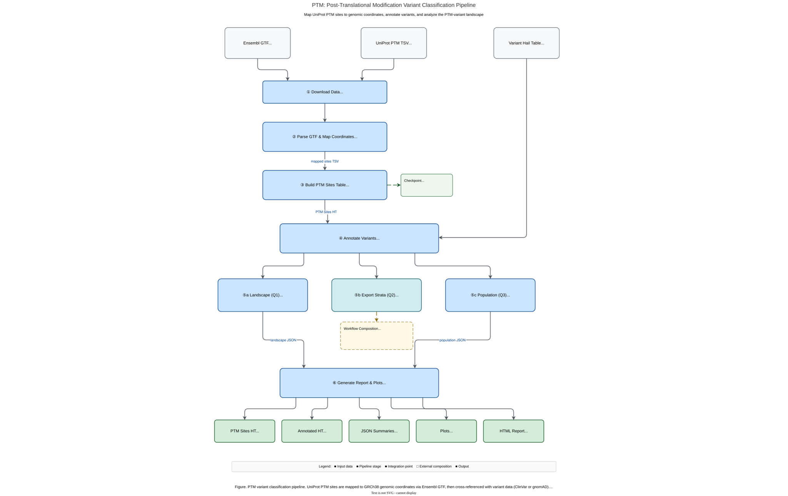

# PTM: Post-Translational Modification Variant Classification

PTM is a module within hvantk that maps post-translational modification sites to genomic coordinates, cross-references them with genetic variants, and analyzes the PTM-variant landscape across the human proteome.



**Figure 1.** *PTM variant classification pipeline. UniProt PTM sites are mapped to GRCh38 genomic coordinates via Ensembl GTF, then cross-referenced with variant data. Three analysis tracks address landscape enrichment (Q1), predictor evaluation via PSROC composition (Q2), and population-level allele frequency comparison (Q3).*

## Overview

The PTM module provides an end-to-end pipeline for studying the relationship between genetic variants and protein post-translational modification sites:

### Primary Functionality

- **Coordinate Mapping** - Map UniProt PTM residue positions to GRCh38 genomic coordinates via Ensembl GTF
- **Variant Annotation** - Annotate variant tables with PTM site proximity (at-site, proximal, non-PTM)
- **Landscape Analysis (Q1)** - PTM-variant overlap counts and enrichment (Fisher's exact test)
- **Population Analysis (Q3)** - Allele frequency distributions at PTM sites vs background
- **Visualization** - Publication-quality plots and HTML reports

### Key Features

- **Local Coordinate Mapping** - No Ensembl REST API dependency; uses GTF-based transcript resolution
- **Split Codon Handling** - Correctly handles codons spanning exon boundaries
- **Position Expansion** - Resolves overlapping flanking intervals via per-position aggregation
- **Workflow Composition** - Predictor evaluation (Q2) composes with PSROC via exported variant strata

## Quick Start

### Command-Line Interface

```bash
# Phase 1-2: Build PTM sites Hail Table
hvantk ptm build \
  --output-dir data/ptm/ \
  --output-ht data/ptm/ptm_sites.ht

# Phase 3: Annotate variants with PTM site information
hvantk ptm annotate \
  --variants-ht clinvar.ht \
  --ptm-ht data/ptm/ptm_sites.ht \
  -o clinvar_ptm.ht

# Phase 4 Q1: Landscape analysis (PTM-variant overlap and enrichment)
hvantk ptm landscape \
  --clinvar-ht clinvar.ht \
  --ptm-ht data/ptm/ptm_sites.ht \
  -o results/landscape/ \
  --save-plots

# Phase 4 Q2: Export strata for PSROC (composed workflow)
hvantk ptm export-strata --annotated-ht clinvar_ptm.ht -o strata/
hvantk psroc --variants strata/ptm_variants.txt --clinvar-ht clinvar.ht ...
hvantk psroc --variants strata/non_ptm_variants.txt --clinvar-ht clinvar.ht ...

# Phase 4 Q3: Population-level allele frequency analysis
hvantk ptm population \
  --gnomad-ht gnomad.ht \
  --ptm-ht data/ptm/ptm_sites.ht \
  -o results/population/ \
  --save-plots

# Phase 5: Generate HTML report
hvantk ptm report -o report.html \
  --landscape-json results/landscape/landscape_summary.json \
  --population-json results/population/population_summary.json
```

### Python API

```python
from hvantk.algorithms.ptm import PTMBuildConfig, ptm_build_pipeline_core

# Build PTM sites table
config = PTMBuildConfig(
    output_dir="data/ptm/",
    output_ht="data/ptm/ptm_sites.ht",
)
result = ptm_build_pipeline_core(config)
print(f"Mapped {result.n_mapped}/{result.n_total} sites")

# Annotate variants
import hail as hl
from hvantk.algorithms.ptm import annotate_variants_with_ptm

variants = hl.read_table("clinvar.ht")
ptm = hl.read_table("data/ptm/ptm_sites.ht")
annotated = annotate_variants_with_ptm(variants, ptm)

# Landscape analysis
from hvantk.algorithms.ptm import ptm_landscape

result = ptm_landscape(variants, ptm, "results/landscape/")
print(result.summary())

# Population analysis
from hvantk.algorithms.ptm import ptm_population

gnomad = hl.read_table("gnomad.ht")
pop_result = ptm_population(gnomad, ptm, "results/population/")
print(pop_result.summary())
```

## Workflow

The PTM pipeline is organized into phases:

| Phase | Command | Description |
|-------|---------|-------------|
| 1-2 | `hvantk ptm build` | Download PTM data, map to genome, build Hail Table |
| 3 | `hvantk ptm annotate` | Annotate variants with PTM site proximity |
| 4 Q1 | `hvantk ptm landscape` | PTM-variant overlap and enrichment |
| 4 Q2 | `hvantk ptm export-strata` + `hvantk psroc` | Predictor evaluation at PTM vs non-PTM sites |
| 4 Q3 | `hvantk ptm population` | Population-level AF analysis |
| 5 | `hvantk ptm report` | HTML report with embedded plots |

### Q2: Predictor Evaluation (Composed Workflow)

Predictor evaluation at PTM sites is achieved by composing `ptm export-strata` with the standalone `psroc` pipeline, rather than duplicating PSROC logic inside the PTM module. This keeps each workflow module self-contained.

```bash
# 1. Annotate ClinVar with PTM info
hvantk ptm annotate --variants-ht clinvar.ht --ptm-ht ptm_sites.ht -o clinvar_ptm.ht

# 2. Export variant strata (PTM vs non-PTM)
hvantk ptm export-strata --annotated-ht clinvar_ptm.ht -o strata/

# 3. Run PSROC independently on each stratum
hvantk psroc --variants strata/ptm_variants.txt --clinvar-ht clinvar.ht --dbnsfp-ht dbnsfp.ht ...
hvantk psroc --variants strata/non_ptm_variants.txt --clinvar-ht clinvar.ht --dbnsfp-ht dbnsfp.ht ...
```

## Build Command Details

### Input Options

The `build` command can download data automatically or use pre-downloaded files:

```bash
# Automatic download (default)
hvantk ptm build --output-dir data/ptm/ --output-ht data/ptm/ptm_sites.ht

# Pre-downloaded files
hvantk ptm build \
  --gtf-path data/ref/Homo_sapiens.GRCh38.113.gtf.gz \
  --ptm-tsv data/ptm/uniprot-ptm-human.tsv \
  --output-dir data/ptm/ \
  --output-ht data/ptm/ptm_sites.ht
```

### Build Options

| Option | Default | Description |
|--------|---------|-------------|
| `--output-dir` | (required) | Directory for intermediate files |
| `--output-ht` | (required) | Output Hail Table path |
| `--gtf-path` | auto-download | Pre-downloaded Ensembl GTF |
| `--ptm-tsv` | auto-download | Pre-downloaded UniProt PTM TSV |
| `--flanking-codons` | 5 | Flanking codons for proximal window |
| `--overwrite` | false | Overwrite existing outputs |

## Annotation Fields

The `annotate` command adds these fields to the variant table:

| Field | Type | Description |
|-------|------|-------------|
| `is_ptm_site` | bool | Variant falls at a PTM-modified codon |
| `is_ptm_proximal` | bool | Variant within flanking window (not at codon) |
| `ptm_types` | set\<str\> | PTM categories (e.g., phosphorylation, ubiquitination) |
| `ptm_distance` | int | Distance in residues to nearest PTM site |

## Output Files

### Landscape (Q1)

| File | Description |
|------|-------------|
| `landscape_summary.json` | Variant counts, enrichment OR/p-value, per-category overlaps, distance distribution |
| `landscape_summary.png` | P/LP and B/LB counts at PTM site vs proximal vs non-PTM (with `--save-plots`) |
| `overlap_by_category.png` | P/LP counts per PTM category (with `--save-plots`) |
| `distance_distribution.png` | P/LP distance to nearest PTM site (with `--save-plots`) |

### Population (Q3)

| File | Description |
|------|-------------|
| `population_summary.json` | AF statistics, variant counts |
| `population_af.png` | Mean AF comparison across PTM strata (with `--save-plots`) |

### Report

| File | Description |
|------|-------------|
| `report.html` | Static HTML report with embedded plots, summary cards, and methods section |

## Data Sources

### UniProt PTM Data

Curated post-translational modification sites from UniProt (human, reviewed/Swiss-Prot). The `build` command queries the UniProt API automatically or accepts a pre-downloaded TSV.

### Ensembl GTF

Gene annotation (exon coordinates, CDS phases) from Ensembl GRCh38. Used for mapping protein residue positions to genomic coordinates. Downloaded automatically or provided via `--gtf-path`.

## Module Structure

```text
hvantk/algorithms/ptm/
├── __init__.py     # Module exports
├── constants.py    # PTM-specific constants (URLs, field names, categories)
├── mapper.py       # GTF parser and residue-to-genomic coordinate mapper
├── pipeline.py     # Build pipeline orchestration (Phases 1-2)
├── annotate.py     # Variant-PTM annotation (Phase 3)
├── analysis.py     # Landscape and population analysis (Phase 4)
├── plot.py         # Visualization functions (Phase 5)
└── report.py       # HTML report generation (Phase 5)
```
