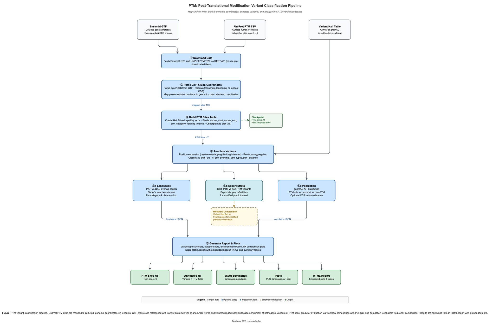

# PTM: Post-Translational Modification Variant Classification

PTM is a module within hvantk that maps post-translational modification sites to genomic coordinates, cross-references them with genetic variants, and analyzes the PTM-variant landscape across the human proteome.



**Figure 1.** *PTM variant classification pipeline. UniProt PTM sites are mapped to GRCh38 genomic coordinates via Ensembl GTF, then cross-referenced with variant data. Three analysis tracks address landscape enrichment, predictor evaluation via PSROC composition, and population-level allele frequency comparison.*

## Overview

The PTM module provides an end-to-end pipeline for studying the relationship between genetic variants and protein post-translational modification sites:

### Primary Functionality

- **Coordinate Mapping** - Map UniProt PTM residue positions to GRCh38 genomic coordinates via Ensembl GTF
- **Variant Annotation** - Annotate variant tables with PTM site proximity (at-site, proximal, non-PTM)
- **Landscape Analysis** - PTM-variant overlap counts and enrichment (Fisher's exact test)
- **Population Analysis** - Allele frequency distributions at PTM sites vs background
- **Visualization** - Publication-quality plots and HTML reports

### Key Features

- **Local Coordinate Mapping** - No Ensembl REST API dependency; uses GTF-based transcript resolution
- **Split Codon Handling** - Correctly handles codons spanning exon boundaries
- **Position Expansion** - Resolves overlapping flanking intervals via per-position aggregation
- **Workflow Composition** - Predictor evaluation composes with PSROC via exported variant strata

## Quick Start

### Command-Line Interface

```bash
# Build the PTM sites Hail Table
hvantk ptm build \
  --output-dir data/ptm/ \
  --output-ht data/ptm/ptm_sites.ht

# Annotate variants with PTM site information
hvantk ptm annotate \
  --variants-ht clinvar.ht \
  --ptm-ht data/ptm/ptm_sites.ht \
  -o clinvar_ptm.ht

# Landscape analysis (PTM-variant overlap and enrichment)
hvantk ptm landscape \
  --clinvar-ht clinvar.ht \
  --ptm-ht data/ptm/ptm_sites.ht \
  -o results/landscape/ \
  --save-plots

# Export strata for PSROC (composed workflow)
hvantk ptm export-strata --annotated-ht clinvar_ptm.ht -o strata/
hvantk psroc --variants strata/ptm_variants.txt --clinvar-ht clinvar.ht ...
hvantk psroc --variants strata/non_ptm_variants.txt --clinvar-ht clinvar.ht ...

# Population-level allele frequency analysis
hvantk ptm population \
  --gnomad-ht gnomad.ht \
  --ptm-ht data/ptm/ptm_sites.ht \
  -o results/population/ \
  --save-plots

# Generate HTML report
hvantk ptm report -o report.html \
  --landscape-json results/landscape/landscape_summary.json \
  --population-json results/population/population_summary.json
```

### Python API

```python
from hvantk.algorithms.ptm import PTMBuildConfig
from hvantk.tools.ptm.pipeline import ptm_build_pipeline

# Build PTM sites table (downloads the UniProt TSV, maps coordinates, builds
# the Hail Table). `ptm_build_pipeline_core` is the pure mapping step this
# wraps; it requires `config.ptm_tsv` to already be set and never builds
# `output_ht` itself.
config = PTMBuildConfig(
    output_dir="data/ptm/",
    output_ht="data/ptm/ptm_sites.ht",
)
result = ptm_build_pipeline(config)
print(f"Mapped {result.n_mapped}/{result.n_total} sites; Hail Table at {result.output_ht}")

# Annotate variants
import hail as hl
from hvantk.algorithms.ptm import annotate_variants_with_ptm

variants = hl.read_table("clinvar.ht")
ptm = hl.read_table("data/ptm/ptm_sites.ht")
annotated = annotate_variants_with_ptm(variants, ptm)

# Landscape analysis
from hvantk.algorithms.ptm import ptm_landscape

result = ptm_landscape(variants, ptm, "results/landscape/")
print(result.summary())

# Population analysis
from hvantk.algorithms.ptm import ptm_population

gnomad = hl.read_table("gnomad.ht")
pop_result = ptm_population(gnomad, ptm, "results/population/")
print(pop_result.summary())
```

## Workflow

Run these commands in order; steps 3–5 are independent analyses:

| Step | Command | Description |
|------|---------|-------------|
| 1 | `hvantk ptm build` | Download PTM data, map to genome, build Hail Table |
| 2 | `hvantk ptm annotate` | Annotate variants with PTM site proximity |
| 3 | `hvantk ptm landscape` | PTM-variant overlap and enrichment |
| 4 | `hvantk ptm export-strata` + `hvantk psroc` | Predictor evaluation at PTM vs non-PTM sites |
| 5 | `hvantk ptm population` | Population-level AF analysis |
| 6 | `hvantk ptm report` | HTML report with embedded plots |

### Predictor Evaluation (Composed Workflow)

Predictor evaluation at PTM sites is achieved by composing `ptm export-strata` with the standalone `psroc` pipeline, rather than duplicating PSROC logic inside the PTM module. This keeps each workflow module self-contained.

```bash
# 1. Annotate ClinVar with PTM info
hvantk ptm annotate --variants-ht clinvar.ht --ptm-ht ptm_sites.ht -o clinvar_ptm.ht

# 2. Export variant strata (PTM vs non-PTM)
hvantk ptm export-strata --annotated-ht clinvar_ptm.ht -o strata/

# 3. Run PSROC independently on each stratum
hvantk psroc --variants strata/ptm_variants.txt --clinvar-ht clinvar.ht --dbnsfp-ht dbnsfp.ht ...
hvantk psroc --variants strata/non_ptm_variants.txt --clinvar-ht clinvar.ht --dbnsfp-ht dbnsfp.ht ...
```

## Constraint Analysis Commands

Two further commands test for allele-frequency depletion at PTM sites, stratified by
tissue or cell type:

- **`hvantk ptm constraint`** — Compares gnomAD allele-frequency distributions between
  PTM-proximal and non-PTM variants, stratified by a metadata field from an expression
  dataset (`--expression-source hail-mt|anndata|tabular`). Runs five tests (per-group
  ranking, tau quartile, LOEUF x group factorial, PTM category x group heatmap,
  within-gene Wilcoxon) and writes TSVs, PNG panels, and an HTML report. Required:
  `--variants-ht`, `--expression-source`, `--expression-path`, `--grouping`,
  `--output-dir`. This is a stratified depletion analysis, not a per-variant scorer.
- **`hvantk ptm test`** — Runs the per-stratum constraint tests directly (`--test lmm` or
  `--test lmm-binned`) against a pre-built variant table, without the plotting/report
  machinery `constraint` adds. Requires the `constraint` extra (`statsmodels`); without
  it, the command fails with a message naming the extra instead of a traceback.

## Build Command Details

### Input Options

The `build` command can download data automatically or use pre-downloaded files:

```bash
# Automatic download (default)
hvantk ptm build --output-dir data/ptm/ --output-ht data/ptm/ptm_sites.ht

# Pre-downloaded files
hvantk ptm build \
  --gtf-path data/ref/Homo_sapiens.GRCh38.113.gtf.gz \
  --ptm-tsv data/ptm/uniprot-ptm-human-<YYYY-MM-DD>.tsv \
  --output-dir data/ptm/ \
  --output-ht data/ptm/ptm_sites.ht

# Add PeptideAtlas and/or CPTAC phosphosites: download them first, then pass the TSV
# path each download prints. All sources are mapped and concatenated into
# ptm_sites_combined.tsv.bgz, which the Hail Table is built from.
hvantk download peptideatlas-phospho -o data/ptm/
hvantk ptm build \
  --output-dir data/ptm/ \
  --output-ht data/ptm/ptm_sites.ht \
  --peptideatlas-tsv data/ptm/peptideatlas-phospho-<build_date>-<build_id>.tsv
```

`build` prints the sites mapped from each source and warns about a source that maps
none, which usually means the wrong file was passed. If no site maps at all, it exits
with an error and writes no Hail Table; a table left at `--output-ht` by an earlier run
is not touched.

### Build Options

| Option | Default | Description |
|--------|---------|-------------|
| `--output-dir` | (required) | Directory for intermediate files |
| `--output-ht` | (required) | Output Hail Table path |
| `--gtf-path` | auto-download | Pre-downloaded Ensembl GTF |
| `--ptm-tsv` | auto-download | Pre-downloaded UniProt PTM TSV |
| `--peptideatlas-tsv` | none | PeptideAtlas phospho TSV written by `hvantk download peptideatlas-phospho` (`peptideatlas-phospho-<build_date>-<build_id>.tsv`); adds its sites |
| `--cptac-tsv` | none | CPTAC phospho TSV written by `hvantk download cptac-phospho` (`cptac-phospho-<cancer_type>.tsv`, or `cptac-phospho-pancancer.tsv` with `--all`); adds its sites |
| `--flanking-codons` | 5 | Flanking codons for proximal window |
| `--overwrite` | false | Overwrite existing outputs |

## Annotation Fields

The `annotate` command adds these fields to the variant table:

| Field | Type | Description |
|-------|------|-------------|
| `is_ptm_site` | bool | Variant falls at a PTM-modified codon |
| `is_ptm_proximal` | bool | Variant within flanking window (not at codon) |
| `ptm_types` | set\<str\> | PTM categories (e.g., phosphorylation, ubiquitination) |
| `ptm_distance` | int | Distance in residues to nearest PTM site |
| `ptm_evidence` | array\<struct\> | Per-site evidence for the nearest PTM site(s) (`source_db`, `evidence_type`, `n_observations`, `uniprot_id`, `gene_symbol`, `residue_pos`, `amino_acid`, `ptm_type`); present only when the input PTM table carries at least one of those fields |

## Output Files

### Landscape

| File | Description |
|------|-------------|
| `landscape_summary.json` | Variant counts, enrichment OR/p-value, per-category overlaps, distance distribution |
| `landscape_summary.png` | P/LP and B/LB counts at PTM site vs proximal vs non-PTM (with `--save-plots`) |
| `overlap_by_category.png` | P/LP counts per PTM category (with `--save-plots`) |
| `distance_distribution.png` | P/LP distance to nearest PTM site (with `--save-plots`) |

### Population

| File | Description |
|------|-------------|
| `population_summary.json` | AF statistics, variant counts |
| `population_af.png` | Mean AF comparison across PTM strata (with `--save-plots`) |

### Report

| File | Description |
|------|-------------|
| `report.html` | Static HTML report with embedded plots, summary cards, and methods section |

## Data Sources

### UniProt PTM Data

Curated post-translational modification sites from UniProt (human, reviewed/Swiss-Prot). The `build` command queries the UniProt API automatically or accepts a pre-downloaded TSV.

### PeptideAtlas and CPTAC Phosphosites

Optional mass-spectrometry phosphosites, added to the same table. `hvantk download peptideatlas-phospho` writes `peptideatlas-phospho-<build_date>-<build_id>.tsv`, which `build` takes with `--peptideatlas-tsv`. A TSV written before the #425 fix (plugin version 0.1.0) carries inflated `n_observations`, and `download` returns an existing file unchanged, so delete it (or pass `--overwrite`) and download again. `hvantk download cptac-phospho` requires the `ptm` extra (`cptac`) and needs `--cancer-type` or `--all`; pass its site table, `cptac-phospho-<cancer_type>.tsv` (or `cptac-phospho-pancancer.tsv` with `--all`), with `--cptac-tsv`, not the `-tumor`/`-normal` TSVs or the matrix and metadata CSVs it also writes. Each mapped row keeps its source in `source_db` (`PeptideAtlas` or `CPTAC`).

### Ensembl GTF

Gene annotation (exon coordinates, CDS phases) from Ensembl GRCh38. Used for mapping protein residue positions to genomic coordinates. Downloaded automatically or provided via `--gtf-path`.

## Module Structure

```text
hvantk/algorithms/ptm/
├── __init__.py               # Module exports
├── constants.py              # PTM-specific constants (URLs, field names, categories)
├── optional_deps.py          # Actionable ImportError naming the `constraint` extra for statsmodels
├── mapper.py                 # GTF parser and residue-to-genomic coordinate mapper
├── pipeline.py               # Build pipeline orchestration
├── annotate.py               # Variant-PTM annotation
├── analysis.py               # Landscape and population analysis
├── plot.py                   # Visualization functions
├── report.py                 # HTML report generation
├── constraint.py             # Stratified constraint analysis orchestrator, for `ptm constraint`
├── constraint_expression.py  # Hail MT / AnnData / tabular expression-source adapter
├── constraint_plots.py       # Diagnostic panels for the constraint analysis
├── constraint_report.py      # HTML report generation for the constraint analysis
└── lmm.py                    # Per-stratum constraint tests (plain and binned-interaction LMM), for `ptm test`
```
