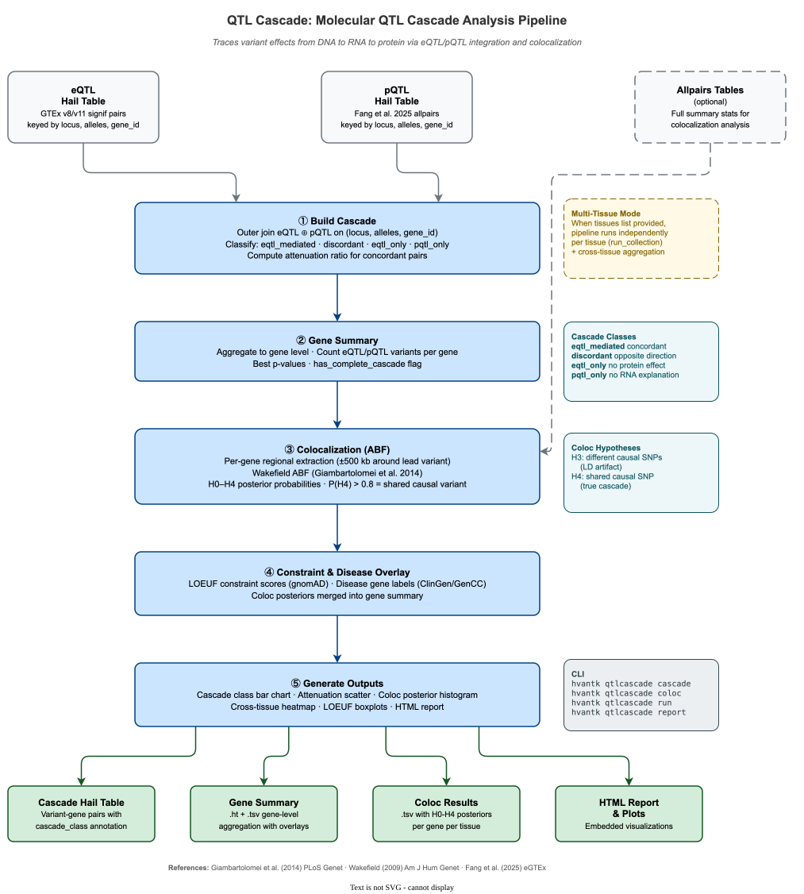

# QTL Cascade: Molecular QTL Cascade Analysis

QTL Cascade is a module within hvantk that traces variant effects across molecular layers — from DNA to RNA (eQTL) to protein (pQTL) — to identify variants whose transcriptomic effects propagate to the proteome. It integrates colocalization analysis to distinguish true signal propagation from LD artifacts.



**Figure 1.** *QTL Cascade pipeline — from eQTL/pQTL table loading through cascade join, gene-level aggregation, colocalization ABF, constraint/disease overlay, and output generation.*

## Overview

The QTL Cascade module provides an end-to-end pipeline for multi-omics QTL integration:

### Primary Functionality

- **Cascade Join** — Outer-join eQTL and pQTL tables on `(locus, alleles, gene_id)`, classify variant–gene pairs into mechanistic categories
- **Gene Summary** — Aggregate cascade results to gene level with variant counts, best p-values, and `has_complete_cascade` flag
- **Colocalization ABF** — Approximate Bayes Factor analysis (Giambartolomei et al. 2014) to test whether eQTL and pQTL share the same causal variant
- **Constraint & Disease Overlay** — Annotate genes with LOEUF scores and disease-gene labels
- **Multi-Tissue Mode** — Run independently per tissue with cross-tissue aggregation

### Key Features

- **Triple-Key Join** — Join on `(locus, alleles, gene_id)` prevents false cascades from LD
- **Four Cascade Classes** — eqtl_mediated, discordant, eqtl_only, pqtl_only
- **Hail + NumPy Hybrid Coloc** — Bulk Spark extraction + per-gene NumPy ABF computation
- **H0–H4 Posterior Probabilities** — Five hypotheses including shared causal variant (H4)
- **Configurable Priors** — Wakefield (2009) ABF parameters and Giambartolomei (2014) coloc priors

## Quick Start

### Command-Line Interface

```bash
# Basic cascade join (no coloc)
hvantk qtlcascade cascade \
  --eqtl-ht /data/eqtl_liver.ht \
  --pqtl-ht /data/pqtl_liver.ht \
  -o /results/cascade.ht

# Full pipeline with coloc and overlays
hvantk qtlcascade run \
  --eqtl-ht /data/eqtl_liver.ht \
  --pqtl-ht /data/pqtl_liver.ht \
  --eqtl-allpairs /data/eqtl_allpairs_liver.ht \
  --pqtl-allpairs /data/pqtl_allpairs_liver.ht \
  --constraint-ht /data/gnomad_metrics.ht \
  --disease-genes-ht /data/clingen.ht \
  -o /results/qtlcascade

# Multi-tissue run
hvantk qtlcascade run \
  --eqtl-ht /data/eqtl.ht \
  --pqtl-ht /data/pqtl.ht \
  --eqtl-allpairs /data/eqtl_allpairs.ht \
  --pqtl-allpairs /data/pqtl_allpairs.ht \
  --tissues "Liver,Heart,Lung" \
  -o /results/qtlcascade_multi

# View execution plan without running
hvantk qtlcascade run \
  --eqtl-ht /data/eqtl.ht \
  --pqtl-ht /data/pqtl.ht \
  -o /results/qtlcascade \
  --dry-run
```

### Python API

```python
from hvantk.qtlcascade import CascadeConfig, CascadePipeline

# Configure pipeline
config = CascadeConfig(
    eqtl_ht="/data/eqtl_liver.ht",
    pqtl_ht="/data/pqtl_liver.ht",
    eqtl_allpairs_ht="/data/eqtl_allpairs_liver.ht",
    pqtl_allpairs_ht="/data/pqtl_allpairs_liver.ht",
    constraint_ht="/data/gnomad_metrics.ht",
    disease_genes_ht="/data/clingen.ht",
    output_dir="/results/qtlcascade",
)

# Run single-tissue pipeline
pipeline = CascadePipeline(config)
result = pipeline.run()

# Inspect results
print(f"Cascade genes: {result.n_cascade_genes}")
print(f"Class counts: {result.class_counts}")
if result.coloc_df is not None:
    n_coloc = (result.coloc_df["H4"] > 0.8).sum()
    print(f"Colocalised genes: {n_coloc}")
```

## Cascade Classes

The cascade join classifies each variant–gene pair into one of four mechanistic categories (Fang et al. 2025, Fig 4C):

| Class | Label | Description |
|-------|-------|-------------|
| `eqtl_mediated` | eQTL-mediated pQTL | Concordant eQTL + pQTL (same effect direction) |
| `discordant` | Discordant | Both present, opposite effect directions |
| `eqtl_only` | eQTL only | eQTL without pQTL evidence |
| `pqtl_only` | pQTL only | pQTL without eQTL evidence |

The classification logic:

```text
eqtl_mediated:  eQTL_beta × pQTL_beta > 0  (concordant direction)
discordant:     both present, product ≤ 0   (opposite direction)
eqtl_only:      eQTL defined, pQTL missing
pqtl_only:      pQTL defined, eQTL missing
```

### Attenuation Ratio

For `eqtl_mediated` pairs, the pipeline computes the attenuation ratio:

```text
attenuation_ratio = 1 - |pQTL_beta| / |eQTL_beta|
```

A value near 0 indicates full propagation (mRNA effect fully passed to protein); near 1 indicates high attenuation (mRNA effect lost at protein level).

## Pipeline Stages

The cascade pipeline executes four stages:

| Stage | Enum | Description |
|-------|------|-------------|
| 1 | `BUILD_CASCADE` | Outer-join eQTL ⊕ pQTL on `(locus, alleles, gene_id)`, classify pairs |
| 2 | `RUN_COLOC` | Colocalization ABF per gene (optional — requires allpairs tables) |
| 3 | `BUILD_GENE_SUMMARY` | Aggregate to gene level with variant counts, p-values, and coloc overlay |
| 4 | `GENERATE_OUTPUTS` | Plots, TSV exports, HTML report |

## Colocalization ABF

The coloc module tests whether eQTL and pQTL signals share the same causal variant using Approximate Bayes Factors (Giambartolomei et al. 2014).

### Five Hypotheses

| Hypothesis | Meaning |
|------------|---------|
| H0 | No association with either trait |
| H1 | Association with eQTL only |
| H2 | Association with pQTL only |
| H3 | Both associated, **different** causal variants (LD artifact) |
| H4 | Both associated, **shared** causal variant (true cascade) |

P(H4) > 0.8 is the default threshold for declaring colocalization.

### ABF Formula

Per-variant log ABF (Wakefield 2009, Eq. 2):

```text
r = W / (W + se²)
log_ABF = 0.5 × (log(1 - r) + r × z²)    where z = beta / se
```

Default prior variance `W = 0.04` (appropriate for quantitative-trait QTLs).

### Implementation

The coloc module uses a Hail + NumPy hybrid approach for efficiency:

1. **Bulk extraction** (Hail/Spark) — Inner-join allpairs tables filtered to cascade genes in a single Spark job
2. **Regional windowing** (Python) — ±500 kb around lead eQTL variant per gene
3. **Per-gene ABF** (NumPy) — Vectorised ABF computation and posterior calculation

### Default Priors

From Giambartolomei et al. (2014), Table 1:

| Parameter | Default | Description |
|-----------|---------|-------------|
| `p1` | 1×10⁻⁴ | P(variant causal for trait 1 only) |
| `p2` | 1×10⁻⁴ | P(variant causal for trait 2 only) |
| `p12` | 1×10⁻⁵ | P(variant causal for both traits) |
| `W` | 0.04 | Prior variance on effect size |

## Multi-Tissue Mode

When `--tissues` is provided, the pipeline runs independently per tissue via `run_collection()`, then generates:

- **Per-tissue outputs** — Cascade HT, gene summary, coloc results for each tissue
- **Cross-tissue heatmap** — Cascade class counts across tissues
- **Collection report** — Combined HTML report

```bash
# Multi-tissue with Fang et al. tissues
hvantk qtlcascade run \
  --eqtl-ht /data/eqtl.ht \
  --pqtl-ht /data/pqtl.ht \
  --tissues "Liver,Heart,Lung,Colon,Thyroid" \
  -o /results/cascade_multi
```

```python
# Python API
config = CascadeConfig(
    eqtl_ht="/data/eqtl.ht",
    pqtl_ht="/data/pqtl.ht",
    tissues=["Liver", "Heart", "Lung", "Colon", "Thyroid"],
    output_dir="/results/cascade_multi",
)
pipeline = CascadePipeline(config)
results = pipeline.run_collection()  # Dict[str, CascadeResult]
for tissue, res in results.items():
    print(f"{tissue}: {res.n_cascade_genes} genes")
```

## Output Files

```text
output_dir/
├── per_tissue/
│   ├── liver/
│   │   ├── cascade.ht/            # Cascade Hail Table (variant-gene pairs)
│   │   ├── gene_summary.ht/       # Gene-level summary Hail Table
│   │   ├── gene_summary.tsv       # TSV export
│   │   └── coloc_results.tsv      # Coloc H0-H4 posteriors per gene
│   ├── heart/
│   │   └── ...
│   └── ...
├── plots/
│   ├── liver_cascade_classes.png   # Cascade class bar chart
│   ├── liver_coloc_posteriors.png  # Coloc P(H4) histogram
│   ├── cross_tissue_heatmap.png   # Cross-tissue comparison
│   └── ...
└── qtlcascade_report.html         # Combined HTML report
```

### Cascade Table Schema

The cascade Hail Table (`cascade.ht`) is keyed by `(locus, alleles, gene_id)`:

| Field | Type | Description |
|-------|------|-------------|
| `eqtl_beta` | float64 | eQTL effect size |
| `eqtl_se` | float64 | eQTL standard error |
| `eqtl_pvalue` | float64 | eQTL p-value |
| `pqtl_beta` | float64 | pQTL effect size |
| `pqtl_se` | float64 | pQTL standard error |
| `pqtl_pvalue` | float64 | pQTL p-value |
| `cascade_class` | str | One of: eqtl_mediated, discordant, eqtl_only, pqtl_only |
| `attenuation_ratio` | float64 | 1 - \|pQTL_beta\|/\|eQTL_beta\| (eqtl_mediated only) |
| `tissue` | str | Tissue label |

### Gene Summary Table Schema

The gene summary Hail Table (`gene_summary.ht`) is keyed by `gene_id`:

| Field | Type | Description |
|-------|------|-------------|
| `n_eqtl_variants` | int64 | Count of eQTL variants for this gene |
| `n_pqtl_variants` | int64 | Count of pQTL variants for this gene |
| `n_concordant` | int64 | Count of eqtl_mediated pairs |
| `n_discordant` | int64 | Count of discordant pairs |
| `best_eqtl_pvalue` | float64 | Minimum eQTL p-value |
| `best_pqtl_pvalue` | float64 | Minimum pQTL p-value |
| `has_complete_cascade` | bool | n_concordant > 0 |
| `oe_lof_upper` | float64 | LOEUF score (if constraint overlay provided) |
| `is_disease_gene` | bool | Disease-gene flag (if overlay provided) |
| `coloc_max_h4` | float64 | Maximum P(H4) across tissues (if coloc run) |
| `coloc_n_tissues` | int64 | Number of tissues with P(H4) > 0.8 |

### Coloc Results Format

The coloc results TSV (`coloc_results.tsv`):

| Column | Description |
|--------|-------------|
| `gene_id` | Ensembl gene ID |
| `tissue` | Tissue name |
| `H0` – `H4` | Posterior probabilities for each hypothesis |
| `n_variants` | Number of variants in the coloc region |

## CLI Reference

### `hvantk qtlcascade cascade`

Build the eQTL ⊕ pQTL outer join with cascade classification.

```text
hvantk qtlcascade cascade [OPTIONS]

Required:
  --eqtl-ht TEXT      Path to eQTL Hail Table
  --pqtl-ht TEXT      Path to pQTL Hail Table
  -o, --output TEXT   Output cascade Hail Table path

Optional:
  --tissue TEXT       Filter to this tissue
  --eqtl-p FLOAT     eQTL p-value threshold [default: 5e-8]
  --pqtl-p FLOAT     pQTL p-value threshold [default: 5e-8]
  --overwrite         Overwrite existing output
```

### `hvantk qtlcascade coloc`

Run colocalization ABF on a set of cascade genes.

```text
hvantk qtlcascade coloc [OPTIONS]

Required:
  --eqtl-allpairs TEXT    Path to allpairs eQTL Hail Table
  --pqtl-allpairs TEXT    Path to allpairs pQTL Hail Table
  --cascade-genes TEXT    File with one gene_id per line
  -o, --output TEXT       Output TSV path

Optional:
  --tissue TEXT           Filter allpairs to this tissue
  --window-kb INTEGER     Regional window ±kb [default: 500]
```

### `hvantk qtlcascade run`

Full pipeline: cascade + gene summary + coloc + report.

```text
hvantk qtlcascade run [OPTIONS]

Required:
  --eqtl-ht TEXT          Path to eQTL Hail Table
  --pqtl-ht TEXT          Path to pQTL Hail Table
  -o, --output-dir TEXT   Output directory

Optional (coloc):
  --eqtl-allpairs TEXT    Allpairs eQTL HT (enables coloc)
  --pqtl-allpairs TEXT    Allpairs pQTL HT (enables coloc)
  --window-kb INTEGER     Coloc window ±kb [default: 500]

Optional (overlays):
  --constraint-ht TEXT    gnomAD constraint HT (LOEUF)
  --disease-genes-ht TEXT Disease-gene HT

Optional (execution):
  --tissues TEXT           Comma-separated tissue list (multi-tissue mode)
  --eqtl-p FLOAT          eQTL p-value threshold [default: 5e-8]
  --pqtl-p FLOAT          pQTL p-value threshold [default: 5e-8]
  --no-plots              Skip plot generation
  --no-report             Skip HTML report
  --overwrite             Overwrite existing outputs
  --dry-run               Show plan without executing
```

### `hvantk qtlcascade report`

Generate HTML report from existing results.

```text
hvantk qtlcascade report [OPTIONS]

Required:
  -o, --output TEXT       Output HTML path

Optional:
  --gene-summary TEXT     Gene summary TSV
  --coloc-results TEXT    Coloc results TSV
  --plots-dir TEXT        Directory containing plot PNGs
  --title TEXT            Report title [default: "QTL Cascade Analysis Report"]
```

## Python API Reference

### Core Functions

#### `build_cascade`

```python
from hvantk.qtlcascade import build_cascade

ht = build_cascade(
    eqtl_ht_path="/data/eqtl.ht",
    pqtl_ht_path="/data/pqtl.ht",
    output_path="/results/cascade.ht",
    eqtl_p_threshold=5e-8,
    pqtl_p_threshold=5e-8,
    tissue="Liver",          # optional tissue filter
    overwrite=False,
)
```

Returns a Hail Table keyed by `(locus, alleles, gene_id)` with cascade classification fields.

#### `build_cascade_gene_summary`

```python
from hvantk.qtlcascade import build_cascade_gene_summary

gene_ht = build_cascade_gene_summary(
    cascade_ht_path="/results/cascade.ht",
    output_path="/results/gene_summary.ht",
    constraint_ht_path="/data/gnomad_metrics.ht",  # optional
    disease_genes_ht_path="/data/clingen.ht",       # optional
    coloc_df=coloc_df,                               # optional pd.DataFrame
    overwrite=False,
)
```

Returns a Hail Table keyed by `gene_id` with aggregated cascade evidence.

#### `coloc_abf`

```python
from hvantk.qtlcascade import coloc_abf
import numpy as np

result = coloc_abf(
    eqtl_beta=np.array([0.5, 0.3, -0.1]),
    eqtl_se=np.array([0.1, 0.1, 0.05]),
    pqtl_beta=np.array([0.4, 0.2, -0.05]),
    pqtl_se=np.array([0.1, 0.1, 0.05]),
    p1=1e-4, p2=1e-4, p12=1e-5, W=0.04,
)
print(f"P(H4) = {result['H4']:.4f}")
# P(H4) ≈ 0.93 — strong evidence for shared causal variant
```

Returns dict with keys `H0`–`H4`, `n_variants`, `lead_snp_h4_idx`.

#### `run_coloc_per_gene`

```python
from hvantk.qtlcascade import run_coloc_per_gene

coloc_df = run_coloc_per_gene(
    eqtl_allpairs_ht_path="/data/eqtl_allpairs.ht",
    pqtl_allpairs_ht_path="/data/pqtl_allpairs.ht",
    cascade_genes=["ENSG00000000003", "ENSG00000000005"],
    tissue="Liver",
    window_kb=500,
)
# Returns pd.DataFrame with columns: gene_id, tissue, H0-H4, n_variants
```

### Pipeline Classes

#### CascadeConfig

```python
from hvantk.qtlcascade import CascadeConfig

config = CascadeConfig(
    # Required
    eqtl_ht="/data/eqtl.ht",
    pqtl_ht="/data/pqtl.ht",
    output_dir="/results/qtlcascade",

    # Coloc (both or neither)
    eqtl_allpairs_ht="/data/eqtl_allpairs.ht",
    pqtl_allpairs_ht="/data/pqtl_allpairs.ht",

    # Overlays
    constraint_ht="/data/gnomad_metrics.ht",
    disease_genes_ht="/data/clingen.ht",

    # Multi-tissue
    tissues=["Liver", "Heart", "Lung"],

    # Thresholds
    eqtl_p_threshold=5e-8,
    pqtl_p_threshold=5e-8,
    coloc_window_kb=500,
    coloc_p1=1e-4,
    coloc_p2=1e-4,
    coloc_p12=1e-5,
    coloc_W=0.04,

    # Output options
    generate_plots=True,
    generate_report=True,
    overwrite=False,
)

# Validate
errors = config.validate()
if errors:
    for e in errors:
        print(f"Error: {e}")
```

#### CascadePipeline

```python
from hvantk.qtlcascade import CascadePipeline

pipeline = CascadePipeline(config)

# Preview execution plan
pipeline.show_plan()

# Single-tissue run
result = pipeline.run(tissue="Liver")

# Multi-tissue run
results = pipeline.run_collection()  # Dict[str, CascadeResult]
```

#### CascadeResult

```python
# Access results
print(f"Tissue: {result.tissue}")
print(f"Cascade HT: {result.cascade_ht_path}")
print(f"Gene summary HT: {result.gene_summary_ht_path}")
print(f"Cascade genes: {result.n_cascade_genes}")
print(f"Class counts: {result.class_counts}")

# Coloc results (if available)
if result.coloc_df is not None:
    print(f"Coloc genes: {len(result.coloc_df)}")
    n_pass = (result.coloc_df["H4"] > 0.8).sum()
    print(f"Colocalised (H4 > 0.8): {n_pass}")
```

### Plotting Functions

```python
from hvantk.qtlcascade import (
    plot_cascade_classes,
    plot_attenuation,
    plot_coloc_posteriors,
    plot_cross_tissue_heatmap,
    plot_loeuf_by_cascade_class,
)

# Cascade class distribution
plot_cascade_classes(
    class_counts={"eqtl_mediated": 150, "discordant": 30,
                  "eqtl_only": 500, "pqtl_only": 200},
    output_path="cascade_classes.png",
    title="Cascade Classes — Liver",
)

# Coloc posterior histogram
plot_coloc_posteriors(
    coloc_df,
    output_path="coloc_posteriors.png",
    title="Coloc P(H4) — Liver",
)

# Cross-tissue heatmap (requires multi-tissue results)
plot_cross_tissue_heatmap(
    df,  # DataFrame with gene_id, tissue, n_concordant columns
    output_path="cross_tissue.png",
)

# LOEUF by cascade class (requires constraint overlay)
plot_loeuf_by_cascade_class(
    gene_summary_df,
    output_path="loeuf_boxplot.png",
)
```

## Building Input Tables

The cascade pipeline requires eQTL and pQTL Hail Tables as input. Build them with `hvantk mktable`:

### eQTL Table

```bash
# GTEx v11 (parquet)
hvantk mktable eqtl \
  --raw-input /data/gtex_v11/signif_pairs/ \
  --output-ht /data/eqtl_liver.ht \
  --source gtex_v11 \
  --tissue Liver

# GTEx v8 (TSV)
hvantk mktable eqtl \
  --raw-input /data/gtex_v8/Liver.v8.signif_variant_gene_pairs.txt.gz \
  --output-ht /data/eqtl_liver.ht \
  --source gtex_v8

# eQTLGen
hvantk mktable eqtl \
  --raw-input /data/eqtlgen/cis-eQTLs_full.txt.gz \
  --output-ht /data/eqtl_blood.ht \
  --source eqtlgen

# Allpairs for coloc (keep all p-values)
hvantk mktable eqtl \
  --raw-input /data/gtex_v11/allpairs/ \
  --output-ht /data/eqtl_allpairs_liver.ht \
  --source gtex_v11 \
  --tissue Liver \
  --p-threshold 0
```

### pQTL Table

```bash
# Fang et al. (2025) pQTL data
hvantk mktable pqtl \
  --raw-input /data/fang_pqtl/Liver_allpairs.txt.gz \
  --output-ht /data/pqtl_liver.ht \
  --source gtex_fang \
  --tissue Liver \
  --gene-map-ht /data/ensembl_gene.ht

# Allpairs for coloc (omit --p-threshold to keep all pairs)
hvantk mktable pqtl \
  --raw-input /data/fang_pqtl/Liver_allpairs.txt.gz \
  --output-ht /data/pqtl_allpairs_liver.ht \
  --source gtex_fang \
  --tissue Liver \
  --gene-map-ht /data/ensembl_gene.ht
```

> **Note:** Fang pQTL data uses gene symbols. The `--gene-map-ht` option provides a reverse-index table (keyed by `gene_id` with `gene_name` field) for symbol → Ensembl ID mapping. Use the Ensembl gene table built with `hvantk mktable ensembl-gene`.

## Module Structure

```text
hvantk/qtlcascade/
├── __init__.py      # Public API surface
├── constants.py     # Thresholds, priors, tissue mappings, source IDs
├── cascade.py       # Outer join + cascade classification
├── coloc.py         # Colocalization ABF (Hail + NumPy hybrid)
├── gene_summary.py  # Gene-level aggregation + overlays
├── pipeline.py      # CascadeConfig, CascadePipeline, CascadeResult
├── plot.py          # Visualisations (cascade classes, attenuation, coloc, heatmap)
└── report.py        # HTML report generation
```

## References

- Giambartolomei, C. et al. (2014) Bayesian Test for Colocalisation between Pairs of Genetic Association Studies Using Summary Statistics. *PLoS Genet* 10(5):e1004383.
- Wakefield, J. (2009) Bayes factors for genome-wide association studies: comparison with P-values. *Am J Hum Genet* 84(1):60-71.
- Fang, H. et al. (2025) Molecular quantitative trait loci in reproductive tissues impact male fertility. *Nature Genetics* (in press).
- Pullin, J. & Wallace, C. (2025) Coloc v6: fast, flexible multi-trait colocalization. *PLoS Genet* 21(5):e1011697.

---

See [Data Sources](../guide/data-sources.md) for acquiring eQTL/pQTL data, [Usage Guide](../guide/usage.md) for building input tables.
